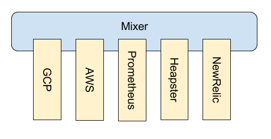

# Istio Architecture

This document describes Istio's end-to-end design, to help you understand what it does and how
it does it.

- [Problem statement](#problem-statement)
- [High-level composition](#high-level-composition)
- [Attributes](#attributes)
- [Configuration](#configuration)
- [The proxy](#the-proxy)
- [The mixer](#the-mixer)
  - [Adapters](#adapters)
- [The manager](#the-manager)
- [Istio and Kubernetes](#istio-and-kubernetes)

## Problem statement

As we move towards a world where cloud developers think in terms of microservices, rather than in terms of low level resources like VMs and firewalls, there 
is a need for a simplifying technology that can take care of common cross-cutting capabilities around service communication and management such as secure 
interconnect, load balancing, service discovery, rate limiting, authentication, access control, monitoring, logging, etc. Having a common, open and 
uniform way to enable these capabilities across services, independent of environment, makes services thinner and portable, teams more agile and focused on 
core business logic, enables sweeping changes through configuration, and makes it easy to monitor the entire service fabric uniformly. Such a fabric can 
help enterprises have a shared horizontal layer which can be maintained by central ops teams and make service teams and code lighter and network agnostic.

## High-level composition

Istio consists of three major components:

- **Proxy**. The Istio proxy is designed to mediate inbound and outbound traffic for all Istio-managed services. It enforces
access control and usage policies, and provides rich routing, load balancing, and protocol conversion. The Istio proxy is based on the
[Envoy proxy](https://lyft.github.io/envoy/) with extensions to fit within the Istio service mesh.

- **Mixer**. The Istio mixer is the nexus of the Istio service mesh. The proxy delegates policy decisions to the mixer, and both the
proxy and Istio-managed services direct all telemetry data to the mixer. The mixer includes a flexible plugin model enabling it
to interface to a variety of host environments and configured backends, abstracting the proxy and Istio-managed services
from these details.

- **Manager**. The Istio manager is used to configure Istio deployments and propagate configuration to 
the other components of the system, including the Istio mixer and the Istio 
proxies deployed in the mesh.

<figure id="fig-arch" class="center">

<figcaption><b>Figure 1</b>: Istio Composition</figcaption>
</figure>

## Attributes

Istio uses *attributes* to describe runtime behavior of services running in the mesh. Attributes are named and typed pieces of metadata
describing ingress and egress traffic and the environment this traffic occurs in. An Istio attribute carries a specific piece
of information such as the error code of an API request, the latency of an API request, or the
original IP address of a TCP connection.
 
Istio's policy evaluation model operates on attributes. For example, access control is configured by
specifying policies against particular attribute values.

A given Istio deployment has a fixed vocabulary of attributes that it understands. The specific vocabulary is
determined by the set of attribute producers being used in the deployment. The primary attribute producer in Istio
is the proxy, although the mixer and services can also introduce attributes.

Attribute producers declare the set of attributes they produce using the `[AttributeDescriptor](https://raw.githubusercontent.com/istio/api/master/mixer/v1/config/descriptor/attribute_descriptor.proto)`
message:

    message AttributeDescriptor {
      // The name of this descriptor, referenced from individual attribute instances and other
      // descriptors.
      string name = 1;
    
      // An optional human-readable description of the attribute's purpose.
      string description = 2;
    
      // The type of data carried by attributes
      ValueType value_type = 3;
    }

    enum ValueType {
        // Invalid, default value.
        VALUE_TYPE_UNSPECIFIED = 0;
    
        // An undiscriminated variable-length string.
        STRING = 1;
    
        // An undiscriminated 64-bit signed integer.
        INT64 = 2;
    
        // An undiscriminated 64-bit floating-point value.
        DOUBLE = 3;
    
        // An undiscriminated boolean value.
        BOOL = 4;
    
        // A point in time.
        TIMESTAMP = 5;
    
        // An IP address.
        IP_ADDRESS = 6;
    
        // An email address.
        EMAIL_ADDRESS = 7;
    
        // A URI.
        URI = 8;
    
        // A DNS name.
        DNS_NAME = 9;
    
        // A span between two points in time.
        DURATION = 10;
    
        // A map string -> string, typically used by headers.
        STRING_MAP = 11;
    }

When an attribute is used in Istio, its name is given along with a value. The value must be of the type declared by the corresponding descriptor. This
type checking makes it possible for the Istio system to statically detect or prevent many configuration errors.

## Configuration

**TBD**

## The proxy

**TBD**

## The mixer

The mixer provides the control-plane abstractions necessary for most real-world multi-tenant services.
The proxy delegates policy decisions to the mixer and dispatches its telemetry data to the mixer, which
proceeds to repackage and redirect the data towards configured backends.

Services within the Istio mesh can also directly integrate with the mixer. For example, services may wish to provide rich telemetry for particular operations
beyond what the proxy automatically collects. Or services may use the mixer for resource-oriented quota management. Services that leverage the mixer in this 
way are abstracted from environment-specific control plane details, greatly easing the process of hosting the code in
different environments (different clouds & on-prem)

The mixer provides three core features:

- **Precondition Checking**. Enables callers to verify a number of preconditions before responding to an incoming request from a service consumer. 
Preconditions can include whether the service consumer is properly authenticated, is on the service's whitelist, passes ACL checks, and more.

- **Telemetry Reporting**. Enables services to produce logging, monitoring, tracing and billing streams intended for the service producer itself as well as 
for its consumers.

- **Quota Management**. Enables services to allocate and free quota on a number of dimensions, Quotas are used as a relatively simple resource management 
tool to provide some fairness between service consumers when contending for limited resources.

### Adapters

Adapters are binary-level plugins to the mixer which make it possible to customize the mixer’s behavior. Adapters allow the mixer to interface 
to different backend systems that deliver core control-plane functionality, such as logging, monitoring, quotas, ACL checking, and more. Adapters
enable the mixer to expose a single consistent control API, independent of the backends in use. The exact set of adapters
used at runtime is determined through configuration.

<figure id="fig-adapters" class="center">

<figcaption><b>Figure 2</b>: Mixer Adapters</figcaption>
</figure>

## The manager

**TBD**

## Istio and Kubernetes

**TBD**
