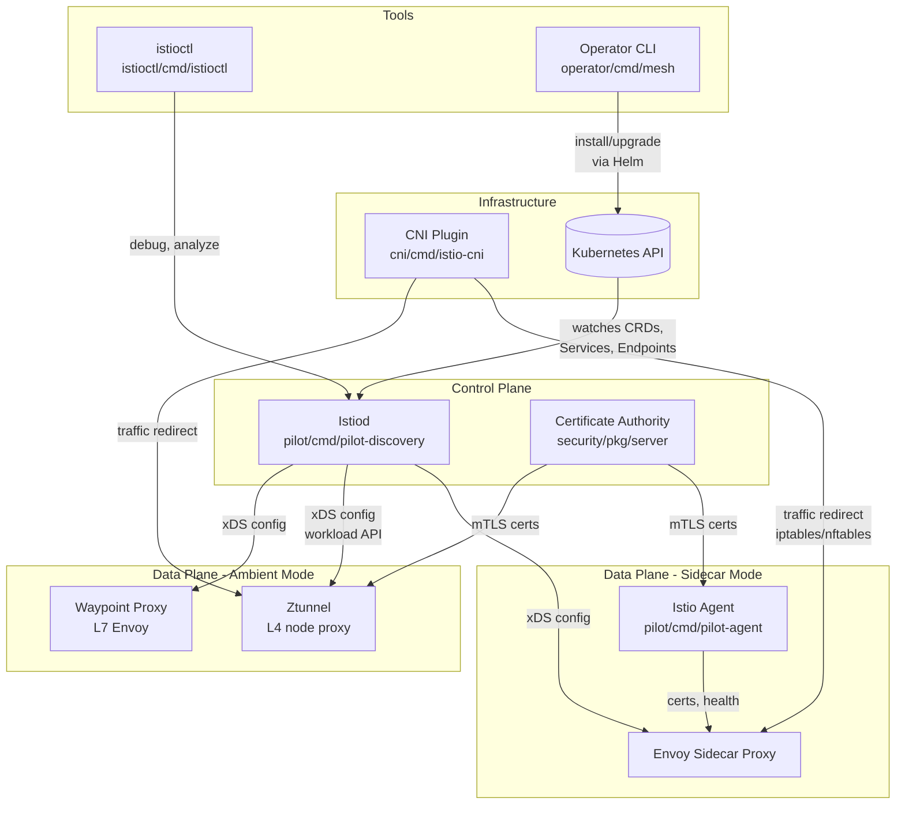

# Architecture

This document describes the high-level architecture of [Istio](https://istio.io), an open-source service mesh that provides traffic management, security (mTLS), and observability for microservices running on Kubernetes.

See also [.github/copilot-instructions.md](.github/copilot-instructions.md) for development workflow, coding conventions, and contribution guidelines. Additional domain knowledge on specific subsystems is available in [.github/.copilot/domain_knowledge/](.github/.copilot/domain_knowledge/).

## High-Level System Diagram


```mermaid
graph TD
    subgraph Control Plane
        istiod[Istiod<br/>pilot/cmd/pilot-discovery]
        ca[Certificate Authority<br/>security/pkg/server]
    end

    subgraph Data Plane - Sidecar Mode
        agent[Istio Agent<br/>pilot/cmd/pilot-agent]
        envoy[Envoy Sidecar Proxy]
        agent -- "certs, health" --> envoy
    end

    subgraph Data Plane - Ambient Mode
        ztunnel[Ztunnel<br/>L4 node proxy]
        waypoint[Waypoint Proxy<br/>L7 Envoy]
    end

    subgraph Infrastructure
        cni[CNI Plugin<br/>cni/cmd/istio-cni]
        k8s[(Kubernetes API)]
    end

    subgraph Tools
        istioctl[istioctl<br/>istioctl/cmd/istioctl]
        operator[Operator CLI<br/>operator/cmd/mesh]
    end

    k8s -- "watches CRDs,<br/>Services, Endpoints" --> istiod
    istiod -- "xDS config" --> envoy
    istiod -- "xDS config<br/>workload API" --> ztunnel
    istiod -- "xDS config" --> waypoint
    ca -- "mTLS certs" --> agent
    ca -- "mTLS certs" --> ztunnel
    cni -- "traffic redirect<br/>iptables/nftables" --> envoy
    cni -- "traffic redirect" --> ztunnel
    istioctl -- "debug, analyze" --> istiod
    operator -- "install/upgrade<br/>via Helm" --> k8s
```

## Project Structure

```text
istio/
├── pilot/                    # Control plane (Istiod)
│   ├── cmd/pilot-discovery/  #   Istiod binary entry point
│   ├── cmd/pilot-agent/      #   Sidecar agent binary entry point
│   └── pkg/                  #   Core logic: xDS, networking, service registry
│       ├── bootstrap/        #     Server initialization
│       ├── model/            #     Internal data models (Service, ServiceInstance)
│       ├── networking/       #     Envoy config generation (listeners, routes, clusters)
│       ├── serviceregistry/  #     Service discovery aggregation
│       ├── xds/              #     xDS server and delta protocol
│       ├── config/           #     Config ingestion (CRD client, file, xDS)
│       ├── credentials/      #     Certificate and credential handling
│       └── controllers/      #     Kubernetes controllers
│
├── pkg/                      # Shared libraries (largest code area)
│   ├── kube/                 #   Kubernetes client, informers, injection
│   │   ├── inject/           #     Sidecar injection
│   │   ├── krt/              #     Kubernetes resource tracking framework
│   │   └── controllers/      #     Shared Kubernetes controllers
│   ├── config/               #   Configuration types, validation, analysis
│   │   ├── crd/              #     CRD schema handling
│   │   ├── gateway/          #     Gateway API translation
│   │   └── mesh/             #     MeshConfig management
│   ├── istio-agent/          #   Istio agent: cert management, SDS, health
│   ├── security/             #   Security utilities
│   ├── dns/                  #   DNS server for sidecar DNS proxying
│   ├── test/                 #   Integration test framework and echo service
│   │   ├── framework/        #     Test infrastructure (cluster setup, assertions)
│   │   └── echo/             #     Echo test service
│   ├── hbone/                #   HTTP-Based Overlay Network Encapsulation
│   ├── adsc/                 #   Aggregated Discovery Service Client
│   ├── wasm/                 #   WebAssembly extension support
│   └── workloadapi/          #   Workload API types for ztunnel
│
├── cni/                      # CNI plugin for traffic interception
│   ├── cmd/install-cni/      #   CNI installer binary
│   ├── cmd/istio-cni/        #   CNI plugin binary
│   └── pkg/
│       ├── nodeagent/        #     Node-level agent for ambient mode
│       ├── iptables/         #     iptables-based redirect rules
│       ├── nftables/         #     nftables-based redirect rules (newer)
│       └── repair/           #     Pod repair/reconciliation
│
├── istioctl/                 # CLI tool for operators
│   ├── cmd/istioctl/         #   Binary entry point
│   └── pkg/                  #   Subcommands: analyze, dashboard, describe, inject...
│
├── operator/                 # Operator CLI for Istio lifecycle management
│   ├── cmd/mesh/             #   Install, manifest-generate commands
│   └── pkg/
│       ├── apis/             #     IstioOperator CRD definitions
│       ├── helm/             #     Helm chart rendering
│       └── manifest/         #     Manifest generation and diffing
│
├── security/                 # Certificate Authority and PKI
│   └── pkg/
│       ├── pki/              #     CSR handling, cert generation, validation
│       ├── server/           #     gRPC CA server for cert issuance
│       └── credentialfetcher/ #    Platform credential fetching (GCE, AWS)
│
├── manifests/                # Deployment artifacts
│   ├── charts/               #   Helm charts (base, istio-control, istio-cni, gateway, ztunnel)
│   ├── profiles/             #   IstioOperator profiles (default, demo, ambient, minimal)
│   └── helm-profiles/        #   Helm value overrides per platform
│
├── tests/                    # Integration and e2e tests
│   └── integration/          #   Test suites: pilot, security, telemetry, ambient, helm
│
├── architecture/             # Design documents
│   ├── networking/           #   Pilot, controllers, Gateway API docs
│   ├── ambient/              #   Ztunnel, peer auth, lifecycle docs
│   ├── security/             #   Istio agent security model
│   └── tests/                #   Integration test architecture
│
├── tools/                    # Build and utility tools
│   ├── istio-iptables/       #   iptables traffic redirect tool
│   ├── istio-nftables/       #   nftables traffic redirect tool
│   ├── docker-builder/       #   Container image builder
│   └── bug-report/           #   Cluster diagnostic collection
│
├── samples/                  # Sample applications (Bookinfo, etc.)
├── release/                  # Release build scripts
├── releasenotes/             # Release note entries
├── common/                   # Shared build scripts (from common-files repo)
├── prow/                     # Prow CI job configs and integration test scripts
├── Makefile                  # Build entry point
└── Makefile.core.mk          # Core build/test targets
```

## Core Components

### Istiod - Control Plane (`pilot/`)

Istiod is a modular monolith that dynamically configures all proxies in the mesh. Its pipeline has three stages:

1. **Config Ingestion** — Watches 20+ Kubernetes resource types (Services, Endpoints, Istio CRDs like VirtualService, DestinationRule, Gateway) via `ConfigStore` and `ServiceDiscovery` interfaces. Sources include CRD client (`pkg/config/crd`), filesystem, and xDS.

1. **Config Translation** — Converts internal models into Envoy configuration (Listeners, Routes, Clusters, Endpoints). Core logic is in `pilot/pkg/networking/core/`.

1. **Config Serving (xDS)** — Serves configuration to proxies over the xDS protocol (ADS - Aggregated Discovery Service). Implementation in `pilot/pkg/xds/`. Supports both full-state and incremental (delta) xDS.

Entry point: `pilot/cmd/pilot-discovery/main.go`

### Istio Agent (`pilot/cmd/pilot-agent`, `pkg/istio-agent/`)

Runs as a sidecar alongside Envoy. Manages certificate provisioning via SDS (Secret Discovery Service), health checking, and Envoy lifecycle. Communicates with Istiod's CA to obtain and rotate mTLS certificates.

Entry point: `pilot/cmd/pilot-agent/main.go`

### CNI Plugin (`cni/`)

A Kubernetes CNI plugin that sets up transparent traffic interception for pods in the mesh. Supports both iptables and nftables backends. In ambient mode, the node agent component manages ztunnel integration.

Entry points: `cni/cmd/istio-cni/main.go` (plugin), `cni/cmd/install-cni/main.go` (installer)

### Istioctl (`istioctl/`)

CLI tool for mesh administration. Key capabilities: configuration analysis (`analyze`), proxy debugging (`proxy-status`, `proxy-config`), sidecar injection (`kube-inject`), and dashboard access.

Entry point: `istioctl/cmd/istioctl/main.go`

### Operator CLI (`operator/`)

Client-side CLI tool (no longer an in-cluster operator) for installing and managing Istio. Renders Helm charts with values derived from the IstioOperator CRD. Supports `install`, `manifest generate`, and `manifest diff` commands.

Entry point: `operator/cmd/mesh/`

### Security / Certificate Authority (`security/`)

Provides the built-in CA that issues SPIFFE-based X.509 certificates for workload identity. Handles CSR signing, certificate validation, and rotation. Embedded within Istiod.

Key packages: `security/pkg/pki/`, `security/pkg/server/`

### Ztunnel (external - `istio/ztunnel`)

A lightweight Rust-based L4 node proxy for ambient mode. Lives in a separate repository (`istio/ztunnel`) but is configured by Istiod via a custom xDS-based workload API (`pkg/workloadapi/`). Handles mTLS encryption and forwards L7 traffic to waypoint proxies.

Helm chart: `manifests/charts/ztunnel/`

## Data Flow

```text
Kubernetes API
    │
    │  watches (Services, Endpoints, Istio CRDs, Gateway API resources)
    ▼
┌──────────────────────────────────┐
│           Istiod                 │
│                                  │
│  ConfigStore ──► Translation ──► xDS Server
│  ServiceDiscovery ──────────────┘│
│  CA (cert signing) ──────────────│
└───────────┬──────────────────────┘
            │  xDS push (LDS, RDS, CDS, EDS)
            ├─────────────────────────────────► Envoy Sidecar
            ├─────────────────────────────────► Gateway (Envoy)
            ├─────────────────────────────────► Waypoint (Envoy)
            └── workload API ─────────────────► Ztunnel
```

Configuration changes in Kubernetes trigger an xDS push. Istiod debounces rapid changes, recomputes affected proxy configurations, and pushes only the delta to connected proxies.

## External Integrations

- **Envoy Proxy** — Data plane. Configured by Istiod over xDS. Built from upstream Envoy with Istio-specific extensions (Wasm, metadata exchange).
- **Kubernetes API** — Primary source of truth for services, endpoints, and Istio CRDs. All components interact with the Kubernetes API via `pkg/kube/`.
- **Gateway API** — Kubernetes SIG-Network API for gateways, supported as a first-class config source. Translation in `pkg/config/gateway/`.
- **SPIFFE / SPIRE** — Identity framework. Istio issues SPIFFE-compliant X.509 SVIDs for workload-to-workload mTLS.
- **Prometheus / Grafana / Jaeger** — Observability stack. Addon manifests in `manifests/addons/`.

## Deployment & Infrastructure

### Helm Charts (`manifests/charts/`)

| Chart              | Namespace     | Purpose                                    |
|--------------------|---------------|--------------------------------------------|
| `base`             | istio-system  | CRDs and cluster-scoped resources          |
| `istio-control`    | istio-system  | Istiod control plane                       |
| `istio-cni`        | kube-system   | CNI plugin DaemonSet                       |
| `gateway`          | user-defined  | Ingress/egress gateway                     |
| `ztunnel`          | istio-system  | Ztunnel DaemonSet (ambient mode)           |

### CI/CD

- **Prow** — Primary CI system. Job configs in `prow/`. Integration tests run on KinD and GKE.

## Development & Testing

### Build

```bash
make build                   # Compile Go binaries
make docker                  # Build container images
make docker.push             # Push to registry (set HUB= and TAG=)
BUILD_WITH_CONTAINER=1 make  # Build inside a container (no local Go required)
```

Key environment variables: `HUB` (image registry), `TAG` (image tag).

### Test Categories

| Category       | Command                            | Location                   |
|----------------|------------------------------------|----------------------------|
| Unit tests     | `make test`                        | `*_test.go` alongside code |
| Race detection | `make racetest`                    | Same as unit tests         |
| Integration    | `make test.integration.kube`       | `tests/integration/`       |
| Helm tests     | `make test.integration.kube.helm`  | `tests/integration/helm/`  |
| Linting        | `make lint`                        | Project-wide               |
| Pre-commit     | `make precommit`                   | Format + lint              |
| Code gen       | `make gen`                         | Proto, CRDs, golden files  |

### Test Framework

Integration tests use a custom framework in `pkg/test/framework/` that manages Kubernetes cluster setup, component deployment, and assertions. The `echo` test service (`pkg/test/echo/`) provides a configurable workload for end-to-end traffic testing.

Tests are tagged with `//go:build integ` and organized by component: `tests/integration/pilot/`, `tests/integration/security/`, `tests/integration/telemetry/`, `tests/integration/ambient/`.

## Further Reading

Detailed design documents for specific subsystems:

- [Istiod Architecture](architecture/networking/pilot.md) — Config ingestion, translation, xDS serving
- [Controllers](architecture/networking/controllers.md) — Kubernetes controller patterns
- [Gateway API Inference Extension](architecture/networking/gateway-api-inference-extension.md)
- [Ztunnel Design](architecture/ambient/ztunnel.md) — Ambient mode node proxy
- [Ztunnel-CNI Lifecycle](architecture/ambient/ztunnel-cni-lifecycle.md) — Pod lifecycle in ambient mode
- [Peer Authentication](architecture/ambient/peer-authentication.md) — mTLS in ambient mode
- [Istio Agent Security](architecture/security/istio-agent.md) — Agent security model
- [Operator](architecture/environments/operator.md) — Operator architecture
- [Integration Tests](architecture/tests/integration.md) — Test infrastructure design

## Glossary

| Term                | Definition                                                                                   |
|---------------------|----------------------------------------------------------------------------------------------|
| **Ambient mode**    | Sidecar-less mesh architecture using ztunnel (L4) and waypoint proxies (L7)                  |
| **Envoy**           | High-performance L4/L7 proxy used as sidecar, gateway, and waypoint                         |
| **HBONE**           | HTTP-Based Overlay Network Encapsulation — tunneling protocol for ambient mode               |
| **Istiod**          | Istio daemon — the unified control plane binary                                              |
| **SDS**             | Secret Discovery Service — xDS API for distributing TLS certificates to Envoy                |
| **Sidecar**         | Envoy proxy injected alongside application containers in a pod                               |
| **SPIFFE**          | Secure Production Identity Framework for Everyone — standard for workload identity            |
| **Waypoint**        | L7 Envoy proxy in ambient mode that handles HTTP routing, policy, and telemetry              |
| **xDS**             | Discovery Service protocol family (LDS, RDS, CDS, EDS, SDS) for Envoy configuration         |
| **Ztunnel**         | Zero-trust tunnel — lightweight L4 node proxy for ambient mode mesh encryption               |
| **IstioOperator**   | CRD and CLI tool for declarative Istio installation and configuration                        |
