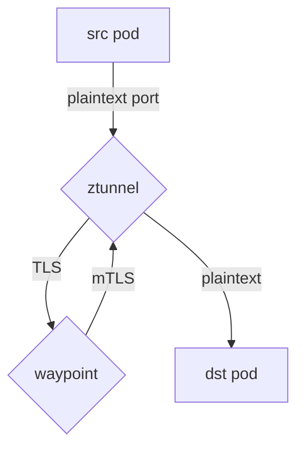
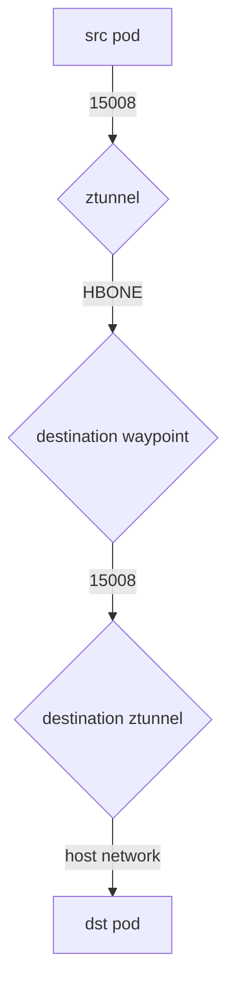

# PeerAuthentication Implementation in Ambient

The PeerAuthentication resource defines policy for whether or not traffic to a given mesh workload must be mTLS encrypted (through Istio mTLS specifically). While the semantics for sidecars are [relatively well defined](https://istio.io/latest/docs/reference/config/security/peer_authentication/), the architectural differences of ambient workloads have implications for how PeerAuthentication is enforced in that context. This document describes those details.

## PeerAuthentication and ztunnel

The goal of ztunnel is to be a minimal L4 proxy, and as such, its xDS configuration is purposefully limited. In particular, ztunnel only supports 2 (custom) xDS resources: [`Workload`](../../pkg/workloadapi/workload.proto) and [`Authorization`](../../pkg/workloadapi/security/authorization.proto). As such, ztunnel does not receive `PeerAuthentication`s directly; when istiod detects a `PeerAuthentication` resource that targets an Ambient captured workload, it computes the effective policy for that workload (taking into account the mesh-wide -> namespace -> workload precedence rules) and sends that policy to ztunnel. The exact details of this conversion is out of scope for this document at the time of writing, but as an example, this `PeerAuthentication`:

```yaml
apiVersion: security.istio.io/v1
kind: PeerAuthentication
metadata:
  name: strict-and-permissive-mtls
spec:
  selector:
    matchLabels:
      app: a
  mtls:
    mode: STRICT
  portLevelMtls:
    9090:
      mode: PERMISSIVE
```

will be translated into this `Authorization`:

```yaml
action: DENY
groups:
- rules:
  - matches:
    - notPrincipals:
      - presence: {}
- rules:
  - matches:
    - notDestinationPorts:
      - 9090
name: converted_peer_authentication_strict-and-permissive-mtls
scope: WORKLOAD_SELECTOR
```

The above policies reject unauthenticated traffic at the ztunnel unless its destination is port 9090. For more complete examples, read through the [test cases](../../pilot/pkg/serviceregistry/kube/controller/ambient/ambientindex_test.go) in the `TestRBACConvert` function.

## PeerAuthentication and the Waypoint Proxy

(Note: this section is not yet implemented and is dependent upon discussion in the [ztunnel hairpinning doc](https://docs.google.com/document/d/1uM1c3zzoehiijh1ZpZuJ1-SzuVVupenv8r5yuCaFshs/edit#heading=h.dwbqvwmg6ud3))

When a ztunnel receives traffic (authenticated or not) from a workload, it will forward that traffic to the Waypoint proxy **after** applying any `TRANSPORT` layer policies (i.e. `Authorization`s). Thus, if the destination workload has at least the equivalent of a `STRICT` `PeerAuthentication`, unauthenticated traffic will be rejected before it reaches the Waypoint proxy. If the effective policy is `PERMISSIVE` (the default), the ztunnel will open a vanilla TLS HBONE tunnel (NOTE: this is not mTLS) to the Waypoint proxy and forward the traffic over that connection without presenting a client certificate. Therefore, it is absolutely critical that the waypoint proxy not assume any identity from incoming connections, even if the ztunnel is hairpinning. In other words, all traffic over TLS HBONE tunnels must be considered to be untrusted. From there, traffic is returned to the ztunnel (still over the TLS HBONE tunnel) and forwarded to the destination workload.

The following diagram illustrates the flow of unauthenticated traffic with a `PERMISSIVE` policy:



And here's an example of an authenticated request to a captured destination:


