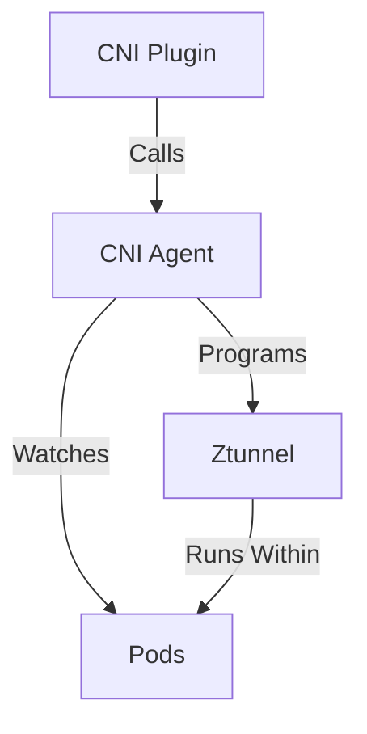

# Ztunnel Lifecycle On Kubernetes

This document describes the lifecycle of various aspects of Ztunnel, and its relationship to workloads and the CNI, when running
as a Kubernetes DaemonSet.

At a high level, our goal is to provide complete connectivity to a workload throughout its entire lifetime.
Failing to do so can be an availability risk (if we deny traffic that should succeed) or a security risk (if we allow traffic that should be denied).

## High level overview

At a high level, the relevant components look as such:

The CNI Plugin is a binary installed as a [CNI plugin](https://kubernetes.io/docs/concepts/extend-kubernetes/compute-storage-net/network-plugins/) on the node.
The container runtime is responsible for invoking this when a Pod is being started (before the containers run).
When this occurs, the plugin will call out to the CNI Agent to program the network.
This includes setting up networking rules within both the pod network namespace and the host network.
For more information on the rules, see the [CNI README](../../cni/README.md).
This is done by an HTTP server running on `/var/run/istio-cni/pluginevent.sock`.

An alternative flow is when a pod is enrolled into ambient mode after it starts up.
In this case, the CNI Agent is watching for Pod events from the API server directly and performing the same setup.
Note this is done while the Pod is running, unlike the CNI plugin flow which occurs before the Pod starts.

Once the network is configured, the CNI Agent will signal to Ztunnel to start running within the Pod.
This is done by the [ZDS](../../pkg/zdsapi/zds.proto) API.
This will send some identifying information about the Pod to Ztunnel, and, importantly, the Pod's network namespace file descriptor.

Ztunnel will use this to enter the Pod network namespace and start various listeners (inbound, outbound, etc).

> [!NOTE]
> While Ztunnel runs as a single shared binary on the node, each individual pod gets its own unique set of listeners within its own network namespace.

## Pod Startup

### Pod Startup Requirements

During new Pod startup, we MUST meet the constraint that the network is ready the instant the application starts (including `initContainers`!).
This is critical -- issues around this were the [top issue with sidecars](https://github.com/istio/istio/issues/11130).

### Pod Startup Implementation

The key mechanism to maintain this property is the CNI plugin.
The CNI plugin is executed synchronously  during the creation of the Pod sandbox by the container runtime, before processes or containers are run within the Pod.
This ensures we can setup the network configuration and start Ztunnel.
Only once those two conditions are met does the CNI plugin return success - effectively allowing our plugin to block Pod scheduling until we are ready.
Otherwise, the CNI plugin will continually be retried, blocking Pod startup until it succeeds.

From the above we are ensured that when the application starts and opens a connection, Ztunnel will be ready to `accept()` it.
However, this is not enough to fully serve the request - Ztunnel will need the certificate (from the CA) and full workload information (from the XDS server).
This is done through a waiting mechanism: Ztunnel will accept all connections, but it will not start forwarding traffic until all the above is fetched.
This "lazy loading" optimizes pod startup time, for the common case where an application is not sending outbound traffic instantly.
For applications that do, they will see a slight latency increase during startup; most applications can handle this far better than failed connections.

## Pod Shutdown

### Pod Shutdown Requirements

During Pod shutdown, we MUST meet the constraint that Pod traffic will be handled until all containerized processes within the Pod have terminated.
Pod shutdown can be a long process; while `terminationGracePeriodSeconds` is typically ~30s, it can be extremely high, leaving terminating pods running for extended periods of time with an expectation of networking.

Additionally, we MUST accept incoming traffic during this time, both new and existing.
Typically, it is rare to get new connections after shutdown has started - once shutdown is triggered the endpoint is marked `NotReady` and removed from load balancing consideration.
However, some applications do not utilize Service readiness (connecting directly to the pod, etc).
Additionally, eventually consistency means we will often get some final requests trickle in before all clients are aware the Pod is shutting down.

Finally, we SHOULD tell our (HBONE) peers we are shutting down.
This can help ensure that clients do not hold onto pooled connections for too long.
This is not strictly required; Ztunnel clients have both keepalives (which will start to fail once the other end is shut down) and pool idle timeouts (which will close the connection when it has had no activity for some period; because the backend is gone, there will be no activity).
However, it would be ideal to give immediate feedback rather than relying on these mechanisms.

### Pod Shutdown Implementation

[ZDS](../../pkg/zdsapi/zds.proto) exposes a `DelWorkload` message to signal to Ztunnel that a pod has been terminated.
This can be triggered either by a Pod being actually deleted, or has transitioned to a [terminal phase](https://kubernetes.io/docs/concepts/workloads/pods/pod-lifecycle/).
At this point, the pod and all containers have fully shut down, and we can tear everything down.

Because the application(s) are already entirely gone, there is no need to have any "draining" time -- we can immediately terminate.
Furthermore, because the Pod is torn down, we cannot even send any data at all (at least on most clusters, the `veth` is torn down upon Pod deletion).
Notably, this prevents us from sending a GOAWAY to notify peers we have shutdown.

As a result, while we meet our two must-haves (send and accept traffic throughout the entire pod lifetime), we do not have an optimal solution here yet.
Alternatively, we could send the GOAWAY prior to the pod termination (assuming this allows existing and new connections to function still).

## Ztunnel Shutdown/Upgrade/Restart

This could be upgrading to a new version, or changing some part of the DaemonSet spec, etc.

### Ztunnel Shutdown Requirements

Our high level requirement is to minimize traffic disruption.

However, because Ztunnel operates only at Layer 4, we are in a tricky position:
* TCP is stateful, so we cannot really just pass state over to the other process.
  If we operated at L3 we could just start processing packets in the new Ztunnel.
* We do not operate at L7, so we cannot signal to the application, in any way, that it should reconnect (to the new Ztunnel).

Realistically, that means the best we can do is:
* Ensure that, at any point in time, any _new_ connections will succeed. There is no period where new connections are dropped.
* Provide some period of time for the old Ztunnel to continue processing any established connections.

If this period of time ("drain period") is longer than any connections, there is zero impact on applications at all.
If not, however, at some point the TCP connection will be torn down.
Depending on the application, this may have a range of impacts (terminating in-flight transactions, etc).

### Ztunnel Shutdown Implementation

The key to this "handoff" between Ztunnels is `SO_REUSEPORT`, which Ztunnel by default sets on all of its listeners.
This enables multiple processes with the same effective UID to bind to the same port (see `man 7 socket` for details).
Linux will then send new connections to one of the processes (first to accept wins, so effectively random).

This still requires delicate sequencing.
Consider a rolling restart of the DaemonSet; the default configuration for Istio's installation.
We will do the following:

1. `ztunnel-new` starts, connects to CNI.
1. CNI sends the current state of all pods on the node. Ztunnel establishes listeners in each pod running on the node, and marks itself "ready".
1. At this point, we have both Ztunnels listening. New connections will be assigned to _either one_.
1. Shortly after, Kubernetes will start terminating `ztunnel-old`. It does this initially by sending a `SIGTERM`. `ztunnel-old` will catch this, and start "draining".
1. Immediately upon starting a drain, `ztunnel-old` will close its listeners. Now only `ztunnel-new` is listening. Critically, at all times there was at least one ztunnel listening.
1. While `ztunnel-old` will not accept *new* connections, it will continue processing existing connections.
1. After `drain period` seconds, `ztunnel-old` will forcefully terminate any outstanding connections.

> [!NOTE]
> Kubernetes will eventually `SIGQUIT` our process if we do not terminate in time.
> A process *typically* gets `terminationGracePeriodSeconds` time to terminate before it is abruptly shut down.
> In the event we do get this signal, our process will be abruptly terminated along with any connections.
> This isn't terribly different from shutting the connections down in Ztunnel, but less graceful - we cannot send a TLS `close_notify`, HTTP/2 `GOAWAY`, etc.
> Ideally, we structure `drain period` such that it is long enough to meet our application requirements, but short enough that we can fully terminate
> before Kubernetes forcefully terminates us.
