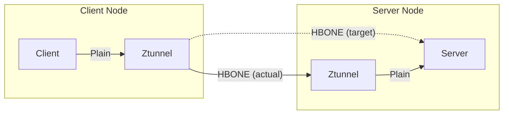

# Ztunnel

This document provides an overview of the architecture and design decisions around Ztunnel, the node-proxy component in ambient mode.

## Background and motivation

Motivations to implement ztunnel generally came from two areas.

First, and most importantly, it serves as a means to implement the real goal: waypoints.
For various reasons outside the scope of this document, there is a desire to move from a sidecar based architecture to a "remote proxy" architecture.
However, this has one glaring issue: how do we get the traffic to the remote proxies, while maintaining the zero-trust properties that Istio is built upon?

A secondary goal was to enable a smoother on-ramp from "Zero" to "Getting some value".
Historically, Istio had to really be consumed all-or-nothing for things to work as expected.
In particular, an easy answer to "I just want to have mTLS everywhere, then I can think about adopting the rest of service mesh" was desired.

Other documents include:
* Deep dive on [Peer Authentication implementation](peer-authentication.md)
* Deep dive on [lifecycle](ztunnel-cni-lifecycle.md) when running on Kubernetes

## Goals

Ztunnel should:
* **Not break users**. This means that deploying Ztunnel should retain all existing Kubernetes behavior.
  * This includes UDP, non-compliant HTTP, server-first protocols, stateful sets, external services, etc.
  * Explicitly opting into behavioral changes can be acceptable. For example, introducing Istio multi-cluster semantics.
* Ensure traffic between mesh workloads is securely encrypted with an Istio identity.
* Be lightweight enough to not limit adoption.
  * This puts a much tighter budget on CPU, memory, latency, and throughput requirements than traditional Istio sidecars.

Ztunnel was not designed to be a feature-rich data plane.
Quite the opposite - an *aggressively* small feature set is the key feature that makes ztunnel viable.
It very intentionally does not offer L7 (HTTP) functionality, for instance, which would likely violate some of the goals above, without contributing to them.
Instead, the rich functionality that service mesh is traditionally associated with is deferred to the waypoints.
The ztunnel is primarily a mechanism to get traffic to the waypoints, securely.

## Proxy implementation

In its initial implementations, the ztunnel was actually implemented in 3 different ways: a bespoke Rust implementation, a bespoke Go implementation, and in Envoy.

In the end, [after evaluation](https://docs.google.com/document/d/1c2123cKuYsBDpIon9FFdctWTUIMFweSjgwG7r8l3818/edit), the decision was to move forward with a Rust implementation.
This offered performance benefits that were too large to leave on the table, as well as opportunities to tune to our specific needs.

## Configuration protocol

Ztunnel, of course, needs to be dynamically configured in order to make decisions on how it should handle traffic.
For this purpose, we chose to use xDS transport protocol due to our expertise and existing infrastructure, and because the protocol is well suited to our needs.

However, while we chose to use the xDS *transport protocol*, we chose to not use the xDS resource types, such as Clusters and Listeners.
In our experience and testing, these types force us to represent data in inefficient ways because they are general purpose.
Ztunnel is not general purpose; it has an extremely tight goal.
We can exploit this to make a more efficient protocol, which is critical to achieve our resource footprint goals.

For example, configuring Istio mTLS in Envoy takes roughly 50 lines of JSON (it is in Protobuf, of course, but still relevant).
Because Ztunnel can have Istio semantics baked in, we do not need to encode all this information on the wire.
Instead, an Istio specific field like `ExpectedTLSIdentity: spiffe://foo.bar` can encode the same information, at a fraction of the cost.

In our testing, even the most generous representations give custom types a 10x edge (in size, allocations, and CPU time) over Envoy types.
In addition, they are more clear and strictly typed; using Envoy types would require us to put a lot of information in untyped `metadata` maps.

With this in mind, Ztunnel supports two xDS resources: `Address` and `Authorization`.

### Address Type

The primary configuration consumed by Ztunnel is the [`Address` resource](../../pkg/workloadapi/workload.proto).
As the name suggests, an `Address` represents a particular IP Address.
This can be a `Service` or a `Workload`.

The address type has the following goals:
* It should support (but not require) on-demand lookups.
  * Specifically, ztunnel should be able to send a request to the control plane to answer "I got a request to send traffic to 1.1.1.1, what is 1.1.1.1?"
  * While this is not needed for small scales, this is important for the long tail of massive clusters (think 1 million endpoints), where the entire set of endpoints cannot reasonably be replicated to each ztunnel.
* It should not be client-specific.
  * In Istio sidecars, historically we had a lot of client-specific xDS. For example, putting the xDS-client's IP back into the xDS response. This makes efficient control plane implementation (most notably, caching), extremely challenging.
  * In practice, this largely means that references are fully qualified in the API. IP Addresses (generally) have a network associated with them, node names have a cluster associated with them, etc.

See the [XDS Evolution](https://docs.google.com/document/d/1V5wkeBHbLSLMzAMbwFlFZNHdZPyUEspG4lHbnB0UaCg/edit) document for more history and details.

The `Workload` aims to represent everything about a workload (generally a `Pod` or `WorkloadEntry`).
This includes things like its IP address, identity, metadata (name, namespace, app, version, etc), and whether it has a waypoint proxy associated.

The `Service` aims to represent everything about a service (generally a `Service` or `ServiceEntry`).
This includes things like its IP addresses, ports and an associated waypoint proxy if it has one.

### Authorization Type

A secondary configuration consumed by Ztunnel is the [`Authorization` resource](../../pkg/workloadapi/security/authorization.proto).
[Original Design Doc](https://docs.google.com/document/d/17mRVzXe8PS7VoligvIx52T10tOP7xPQ9noeOzoLO2cY/edit).

This resource aims to represent the relatively small set of Authorization policies that Ztunnel support.
Most notably, this is only L4 resources.

Most of the API is fairly straight forward.
However, one interesting aspect is how these policies associate with workloads.
Istio's AuthorizationPolicy has label selectors.
However, we intentionally do not send those as part of the Workload API, in order to keep the size low.

The obvious solution to this is to put the list of selected workloads into the policy itself.
However, this means anytime a workload changes (often), we need to update the policy.

Instead, the opposite was chosen: each workload will list the policies that select it.
This works out to be more efficient in common cases where policies change much less often than workloads.
This only applies for selector-based policies; namespaced and global policies can be handled without needing to list them out in the Workload API.

## Redirection

As ztunnel aims to transparently encrypt and route users traffic, we need a mechanism to capture all traffic entering and leaving "mesh" pods.
This is a security critical task: if the ztunnel can be bypassed, authorization policies can be bypassed.

Redirection must meet these requirements:
* All traffic *egressing* a pod in the mesh should be redirected to the node-local ztunnel on port 15001.
  * It is critical that this path preserves the Service IP, if the traffic was to a Service.
* All traffic *ingressing* a pod on port 15008 in the mesh is assumed to be HBONE, and should be redirected to the node-local ztunnel on port 15008 (more on this later).
* All other traffic *ingressing* a pod in the mesh should be redirected to the node-local ztunnel on port 15006, regardless of intended original destination port.

TODO: fill in implementation details of how redirection is actually implemented.

## HBONE

Along with pass-through traffic, Ztunnel supports the "HBONE" (HTTP-Based Overlay Network) protocol.
This is not really so much a new protocol, but rather a name we came up with to refer to the expectations of clients and servers communicating in the mesh.

HBONE is just a standard HTTP `CONNECT` tunnel, over mutual TLS with mesh (SPIFFE) certificates, on a well known port (15008).
The target destination address is set in the `:authority` header, and additional headers can be included as well.
Currently, only HTTP/2 is supported, though HTTP/1.1 and HTTP/3 are planned.

Currently, SNI is not set by Istio clients and ignored by Istio servers.
This makes identifying which certificate to use problematic for Ztunnel.
To handle this, requests to Ztunnel are sent to `DestinationPod:15008` and redirected to ztunnel, rather than `ZtunnelPod:15008`.
The original destination is then extracted to determined which certificate to use.
SNI is not used because it is illegal to use IPs in SNI, and there is no other existing standard format to represent what we need to.
Additionally, using the redirection mechanism reduces the need for clients to know the destination's ztunnel address.

Below shows an example outbound request. The "target" path is what the client sends, while the "actual" path is the real network flow after redirection.

### Pooling

User connections can be multiplexed over shared HBONE connections.
This is done through standard HTTP/2 pooling.
The pooling is keyed off the `{source identity, destination identity, destination ip}`.

### Headers

Ztunnel uses the following well-known headers in HBONE:

| Header        | Purpose                                                                                                                                                                                                                                                 |
|---------------|---------------------------------------------------------------------------------------------------------------------------------------------------------------------------------------------------------------------------------------------------------|
| `:authority`  | Required in `CONNECT`, this is the target destination                                                                                                                                                                                                   |
| `Forwarded`   | For outgoing requests, the original source IP. Note that since we spoof IPs in most cases, this usually is the same as the actual IP seen. For incoming requests, this is used only for traffic from waypoints (which are trusted and cannot spoof IPs) |
| `Baggage`     | (Experimental, likely to be removed) This contains metadata about the source/destination workload for telemetry purposes                                                                                                                                |
| `Traceparent` | (Experimental) This maintains tracing information. Note this is tracing of *connections*, and is not correlated to tracing of user's own HTTP requests. However, this is useful to follow a connection across ztunnels.                                 |

## Traffic routing

Based on the three [redirection](#redirection) paths, the ztunnel has three primary types of traffic it handles.

### Outbound

Requests leaving a pod go through the "outbound" code path on port 15001.
This is where most of Ztunnel's logic lives.

For outbound traffic, we need to first determine where the traffic is destined to.
As Ztunnel operates at L4, we only have the destination IP/port (recovered via `SO_ORIGINAL_DST`).
This may be an IP of a Service, a Pod, or something outside the cluster.
Ztunnel will look up the destination from the [addresses](#address-type) it is configured with.

For traffic to unknown addresses, or to workloads that are not a part of the mesh, the traffic will just be passed through as is.
To make ztunnel more transparent, the original source IP address will be spoofed.
Additionally, `splice` will be used to make this proxying more efficient when possible.

For traffic in the mesh, things are a bit more complex:

1. If the destination has a waypoint proxy, we must send it to the waypoint (using HBONE).
   When we do this, we will want to preserve the original destination Service IP, as the waypoint can do a better job picking a backend pod than we can.
   Note: the application itself may have already resolved the Service IP to a specific pod if it has Kubernetes native routing built in; since we don't have the Service information in this case we will use the destination IP we received (a pod). Most notably, sidecar proxies behave this way.
1. If the destination is on our node, we "fast path" the request and convert this into an inbound request.
   This has the same semantics as if we had sent a request back to ourselves, but is more efficient and reduces complexity in the Ztunnel.
1. Otherwise, we forward the request to the destination using HBONE. If the destination is a Service, we resolve this to a specific pod IP.

In all cases, we spoof the original source IP.

### Inbound Passthrough

Traffic entering a pod that is not transmitted over HBONE  (i.e. with a destination port != 15008) is handled by the "inbound passthrough" code path, on ztunnel's port 15006.

This is fairly straightforward.

First, we need to check that this traffic is allowed.
Traffic may be denied by RBAC policies (especially from a `STRICT` mode enforcement, which denies plaintext traffic).

If it is allowed, we will forward to the target destination.

#### Hairpin

In the case that the destination has a waypoint, that waypoint must have been bypassed to reach the inbound passthrough codepath.
How we handle this is [under discussion](https://docs.google.com/document/d/1uM1c3zzoehiijh1ZpZuJ1-SzuVVupenv8r5yuCaFshs/edit#heading=h.dwbqvwmg6ud3).

### Inbound

Traffic entering a pod over HBONE will be handled by the "inbound" code path, on port 15008.

Incoming requests have multiple "layers": TLS wrapping HTTP CONNECT that is wrapping the user's connection.

To unwrap the first layer, we terminate TLS.
As part of this, we need to pick the correct certificate to serve on behalf of the destination workload.
As discussed in [HBONE](#hbone), this is based on the destination IP.
Additionally, we enforce the peer has a valid mesh identity (but do not assert _which_ identity, yet).

Next, we terminate the CONNECT.
From the [headers](#headers), we know the target destination.
If the target destination has a waypoint, we enforce that the request is coming from that waypoint. Otherwise, the request is rejected.
If there is no waypoint, ztunnel will enforce RBAC policies against the request.

If all checks pass, ztunnel will open a connection to the target. This will spoof the source IP (from `Forwarded` for waypoints, or the incoming IP otherwise).
Once the connection is established we return a 200 HTTP code, and bi-directionally copy data to/from the tunnel to the destination.

## Certificates

Ztunnel certificates are based on the standard Istio SPIFFE format: `spiffe://<trust domain>/ns/<ns>/sa/<sa>`.

However, the identities of the certificates will be of the actual user workloads, not Ztunnel's own identity.
This means Ztunnel will have multiple distinct certificates at a time, one for each unique identity (service account) running on its node.

When fetching certificates, ztunnel will authenticate to the CA with its own identity, but request the identity of another workload.
Critically, the CA must enforce that the ztunnel has permission to request that identity.
Requests for identities not running on the node are rejected.
This is critical to ensure that a compromised node does not compromise the entire mesh.

This CA enforcement is done by Istio's CA, and is a requirement for any alternative CAs integrating with Ztunnel.

Note: Ztunnel authenticates to the CA with a Kubernetes Service Account JWT token, which encodes the pod information, which is what enables this.

Ztunnel will request certificates for all identities on the node.
It determines this based on the Workload xDS configuration it receives.
When a new identity is discovered on the node, it will be enqueued for fetching at a low priority, as an optimization.
However, if a request needs a certain identity that we have not fetched yet, it will be immediately requested.

Ztunnel additionally will handle the rotation of these certificates (typically 24hr expiration) as they approach expiry.

## Telemetry

Ztunnel emits the full set of [Istio Standard Metrics](https://istio.io/latest/docs/reference/config/metrics/), for the 4 TCP metrics.
