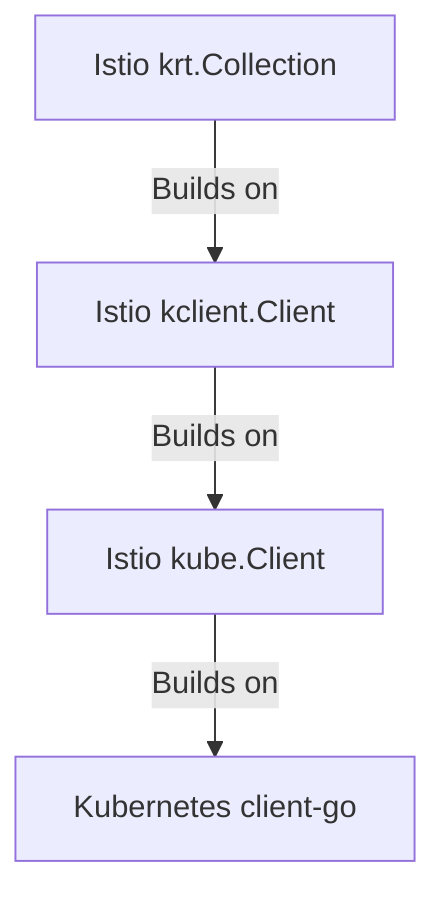

# Controllers

Istio has a variety of [controllers](https://kubernetes.io/docs/concepts/architecture/controller/), which basically watch some inputs and do something.
This can be reading from Kubernetes and writing other objects back, writing to proxies over XDS, etc.

Unfortunately, writing controllers is very error prone, even for seemingly simple cases.
To work around this, Istio has a variety of abstractions meant to make writing controllers easier.

## Clients

Istio offers a variety of increasingly high level abstractions on top of the common Kubernetes [`client-go`](https://github.com/kubernetes/client-go).

**`kube.Client`** is a fairly light wrapper around Kubernetes clients, but offers quite a few benefits.
Istio consumes _many_ different types of clients (at the time of writing, 7), as well as informers for each of these.
Additionally, we often need to convert to various different client forms for different libraries we integrate with.

`kube.Client` just bundles these all in one place, so we have a single object to pass around anywhere we need Kubernetes access.
Additionally, it has a fake client variant, that does the same thing but with fake clients for use in unit tests.

Aside from this, there are a few conveniences and workarounds built-in to the client to make things simpler.

*All Istio Kubernetes usage should use this library and not operate on Kubernetes clients directly.*

**`kclient.Client`** is a higher level wrapper around a Kubernetes resource, and is built up of sub-parts `kclient.Reader`, `kclient.Writer`, and `kclient.Informer`.
Typically, the whole `kclient.Client` is used, though.

Functionality offered by `kclient` includes:
* Typed clients (via generics) and more ergonomic APIs
* Ability to make a _delayed_ client. This is used when making clients based on CRDs that may not exist.
  In general, Istio does not fail on missing CRDs and prefers to treat these as if there were just zero resources for that client.
  The `NewDelayedInformer` abstracts that entirely, offering the same API as normal `kclient.Client`.
* Simple object filtering. Beyond just static filters on objects, `kclient` supports _dynamic filters_ that can change at runtime.
  When a filter changes and includes/removes new objects, those are automatically handled.
* Proper syncing and shutdown logic. Checking for when an informer has fully started can be quite tricky; `kclient` automatically handles it.

Under the `kclient` package, `clienttest` also provides similar interfaces meant for writing unit tests.

*All Istio informer usage should use this library and not operate on Kubernetes informers directly.*

**`krt`** is a very high level wrapper around Kubernetes informers, building on top of `kclient`.

See the [krt README](../../pkg/kube/krt/README.md) for more information.

*krt is currently experimental; please ask maintainers before utilizing it in new areas.*

## Writing Controllers

The `controllers` package offers a variety of helpers for writing controllers.
These operate in a similar manner as [`controller-runtime`](https://github.com/kubernetes-sigs/controller-runtime) but are *far* smaller and less abstract.

With a few exceptions, Istio controllers typically are split in two phases: construction and running.

Construction should create informers (via `kclient.New`), setup a queue (via `controllers.NewQueue`), and register event handlers on the informers.
Often, these handlers are adding something to the queue like `client.AddEventHandler(controllers.ObjectHandler(queue.AddObject))`.
Construction should NOT actually start running all of these things, do I/O, or block in any way.

Running the controller actually starts processing things.
Normally, this just means running the queue.
All informers created by `kube.Client` are kept track in the client, and started in one go with `RunAndWait` in one centralized call.
As a result, each individual controllers should simply wait until informers have synced, then run the queue to start processing things.

A queue is used to give a few properties:
* Ability to serially process updates received from a variety of different sources. This avoids need for other synchronization mechanisms like mutexes.
* Correctness at startup; with the sequencing above, items are only processed once all informers are synced. This means queries will not return stale data at startup.
* Deduping of identical events
* Automatic retrying of failed events (configurable)

The above logic is critical to handle correctly to ensure correctness of a controller.
The [Example Controller](../../pkg/kube/controllers/example_test.go) is a key reference point for any controller development;
while there are a few exceptional cases that should behave differently, for the most part any divergence from the reference code results in bugs.
