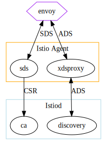
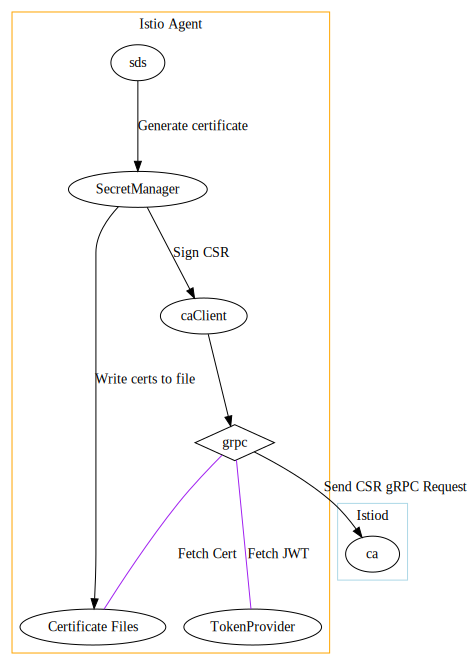

# Istio Agent

This document describes the internal architecture of Istio agent.

## High Level overview

At a high level, the Istio agent acts as an intermediate proxy between Istiod and Envoy. This is done
at two levels. For distributing workload certificates, Envoy will send [SDS](https://www.envoyproxy.io/docs/envoy/latest/configuration/security/secret)
requests to the agent, causing the agent to submit a CSR to the configured CA (generally Istiod). For other configuration,
Envoy will send [ADS](https://www.envoyproxy.io/docs/envoy/latest/intro/arch_overview/operations/dynamic_configuration#aggregated-xds-ads)
requests to the agent, which will be forwarded to the configured discovery server (general Istiod).

## CA Flow

istio-agent checks the presence of a socket file on the defined **socket path** `/var/run/secrets/workload-spiffe-uds/socket`.

* If a socket is found, istio-agent will not start its own SDS Server and Envoy will be configured to use that socket as its source of cryptographic material.
* If a socket is not found, istio-agent then checks whether certificate files are present or not on the defined **certificate path** `/var/run/secrets/workload-spiffe-credentials`. If certificate files are found, istio-agent will start its own SDS Server, listening and serving these certificates on the defined **socket path** `/var/run/secrets/workload-spiffe-uds/socket`,
   while also keeping file watchers on them. Envoy proxy then connects to istio-agent's SDS Server through the defined socket path and gets the cryptographic materials of the certificate files served by the SDS API.
* If istio-agent does not find either the socket, or the certificate files in their respective paths it will start its own SDS Server using a `caClient` to connect to istiod or an external CA, to fetch cryptographic materials (See Default CA Flow).

### Default CA Flow through istio-agent

A single SDS request from Envoy goes through a few different layers in istio-agent.

1. First, the request is handled by the SDS server. This is mostly just an intermediate translation layer exposing
   the `SecretManager` to Envoy, without much business logic. For each resource requested by Envoy, the SDS server
   will call `SecretManager.GenerateSecret(resourceName)`
1. When `GenerateSecret` is called, the `SecretManager` is expected to return a new certificate. This can occur in a few ways.
   1. The most common method (pictured above) is to sign a new certificate by calling the configured CA. Typically, this is Istiod.
   1. If the certificate is not yet expired, the `SecretManager` also can return a cache response. In practice, this would
       only happen in cases where Envoy were to re-request a resource, which is fairly rare.
   1. `SecretManager` can also read certificates from files. When this is configured, no CA client is used.
1. The `caClient` will be configured to use either JWT or mTLS authentication. For JWT authentication, gRPC's `PerRPCCredentials`
   is configured with a `TokenProvider` which handles the logic of adding the proper JWT to each request. mTLS is configured
   by a tls.Config that points to files on disk.

It should be noted there is a circular dependency with mTLS authentication; in order to fetch a certificate we need
a certificate. This can be handled in various ways:
* `GenerateSecret` may additionally write any signed certificates to disk, with `OUTPUT_CERTS` configured.
* Users may have external CA setups that pre-configure certificates.
* The CaClient can use JWT token for the initial setup, then switch to mTLS certificates.

Note that `OUTPUT_CERTS` can be used to refresh certificates using previously provisioned certificates, by configuring
the ca client to use certificates written to the same directory we have configured them to be written to.

## Authentication

The agent supports two forms of authentication with the CA/discovery servers: mTLS and JWT. Varying deployment
topologies mix and match these two.

For a standard Kubernetes deployment, both CA and discovery will use JWT authentication, with a token automatically
[generated and rotated by Kubernetes](https://kubernetes.io/docs/tasks/configure-pod-container/configure-service-account/#service-account-token-volume-projection).

For discovery, the JWT token will be read directly from a file and sent as is. For CA, this logic is a bit more complex,
as the support for external CAs is more mature than external discovery servers. This supports some additional
configuration, a `CredentialFetcher` which allows fetching a token from places other than a file (for example, a local
metadata server), and a `TokenExchanger` which allows exchanging a token for another form to match the CA server requirements.

For VMs, the standard flow is for the user to provision a short-lived JWT token onto the VM. After the initial
CSR, certificates are written to disk and mTLS is used for future requests. If the VM restarted, it would continue
to use the certificates written to disk, assuming the downtime is less than certificate expiration. This is why
the certificates are persisted to disk, rather than kept in memory like in the standard Kubernetes deployment.

## Certificate Rotation

The agent also handles rotating certificates near expiration. It does so by triggering a callback from the `SecretManager` to the SDS server
when a certificate is near expiration (configurable by `SECRET_GRACE_PERIOD_RATIO`, defaulting to half of the expiration). If the SDS server
is still interested in this certificate (ie, Envoy is still connected and requesting the certificate), the SDS server will send another request
to generate a new secret and push the updated certificate to Envoy. This ensures that we do not permanently watch certificates even after
Envoy has stopped requested them; if there are no subscriptions they update will be ignored. If Envoy later watches these certificates again,
a new one will be generated on demand.

## Configuration

| Variable | Description |
| - | - |
|CA_ADDR|Address of CA, defaults to discoveryAddress|
|CA_PROVIDER|Type of CA; supported values are GoogleCA or Citadel (although anything but GoogleCA will use Citadel); defaults to Citadel|
|PROV_CERT|certificates to be used for mTLS communication with control plane only; NOT for workload mTLS|
|OUTPUT_CERT|write all fetched certificates to some directory. Used to support applications that need certificates (Prometheus) as well as rotating mTLS control plane authentication.|
|FILE_MOUNTED_CERTS|completely disable CA path, exclusively use certs mounted into the pod with set certificate file locations|
|CREDENTIAL_FETCHER_TYPE|allows using custom credential fetcher, for VMs with existing identity|
|CREDENTIAL_IDENTITY_PROVIDER|just used to control the audience for VMs with existing identity|
|PROXY_XDS_VIA_AGENT|use istio-agent to proxy XDS. True for all use cases now, likely can be always-on now or soon|
|PROXY_XDS_DEBUG_VIA_AGENT|Offer XDS istio.io/debug API on agent's 15004 HTTP endpoint. (Requires PROXY_XDS_VIA_AGENT)|
|{XDS,CA}_ROOT_CA|explicitly configure root certificate path|
|PILOT_CERT_PROVIDER|just used to determine XDS/CA root certificate; redundant with {XDS,CA}_ROOT_CA.|
