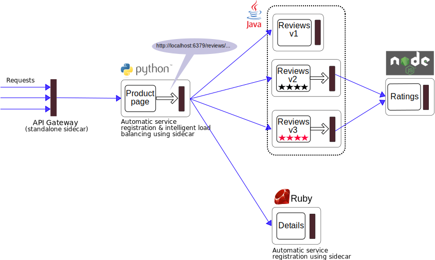

In this demo, we will deploy a simple app that displays information about a
book, similar to a single catalog entry of an online book store. Displayed
on the page is a description of the book, book details (ISBN, number of
pages, and so on), and a few book reviews.

The bookinfo application is broken into four separate microservices:

* *productpage*. The productpage microservice calls the *details* and *reviews* microservices to populate the page.
* *details*. The details microservice contains book information.
* *reviews*. The reviews microservice contains book reviews. It also calls the *ratings* microservice.
* *ratings*. The ratings microservice contains book ranking information that accompanies a book review. 

There are 3 versions of the reviews microservice:

* Version v1 doesn't call the ratings service.
* Version v2 calls the ratings service, and displays each rating as 1 to 5 black stars.
* Version v3 calls the ratings service, and displays each rating as 1 to 5 red stars.

The end-to-end architecture of the application is shown below.



This application is polyglot, i.e., the microservices are written in
different languages. All microservices are packaged with an
Istio sidecar that manages all incoming and outgoing calls for the service.

### Goals of the demo

* We will use Istio's content-based routing feature to selectively
enable `reviews v2` for a specific QA user named `jason`.

* Using Istio's systematic resilience testing feature, we will inject
faults into the communication between microservices and test the failure
recovery capability of the application. The impact of the failure will be
restricted to only the QA user `jason`.

* After fixing the bugs exposed by systematic resilience testing, we will
gradually rollout a new version `reviews v3` similar to a canary rollout.

## Deploy the App

The commands to deploy the bookinfo demo application for different
environments are as follows:

1. Bring up the containers:

   ```bash
   kubectl create -f examples/bookinfo.yaml
   ```

1. Set the gateway environment variable:

   ```bash
   export GATEWAY_URL=$(minikube ip):32000
   ```

### List the Services in the App

You can view the microservices that are running using the following command:

```bash
TODO: command to list running istio services
```
    
The expected output is the following:

```bash
TODO: command output showing all the running service versions/instances
```

There are 4 microservices as described in the diagram above. The `reviews`
microservice has 3 versions v1, v2, and v3. Note that in a realistic
deployment, new versions of a microservice are deployed over time
instead of deploying all versions simultaneously.

## Set the default routes

By default, routes need not be set in Istio. When no routes are present,
Istio sidecars route requests in a random fashion to one of the
instances of the target microservice. However, _it is advisable to
explicitly set a default route for each microservice, so that when a new
version of a microservice is introduced, traffic to the new version can be
released in a controlled fashion_.

Lets route all of the incoming traffic to version `v1` only for each service.

```bash
TODO: commands to route all traffic to v1 version of all 4 services
```

Confirm the routes are set by running the following command:

```bash
TODO: command to show the current routes
```

You should see the following output:

```
TODO: command output showing all 4 services are routing traffic to v1
```

Open
[http://GATEWAY_URL/productpage/productpage](http://localhost:32000/productpage/productpage)
from your browser and you should see the bookinfo application `productpage`
displayed.  Notice that the `productpage` is displayed, with no rating
stars since `reviews:v1` does not access the ratings service.

**Note**: Replace `GATEWAY_URL` with the output of the following command:

```bash
echo $GATEWAY_URL
```

## Content-based routing

Lets enable the ratings service for test user "jason" by routing productpage
traffic to `reviews:v2` instances.

```bash
TODO: command to send traffic traffic for user jason to v2
```

Confirm the routes are set:

```
TODO: command to show the current routes
```

You should see the following output:

```
TODO: command output showing updated route
```

Log in as user "jason" at the `productpage` web page.
You should now see ratings (1-5 stars) next to each review.

## Fault Injection

We will now test the bookinfo application with the newly
introduced `reviews:v2` version of the reviews microservice. The
_reviews:v2 service has a 10s timeout for its calls to the ratings 
service. We will _inject a 7s delay_ between the reviews:v2 and ratings
microservices and ensure that the end-to-end flow works without any errors.

Lets add a fault injection rule that injects a 7s
delay in all requests with an HTTP Cookie header containing the value
`user=jason`. In other words, we are confining the faults only to the QA
user.

```bash
TODO: command to set a rule that injects delay when reviews:v2 calls ratings service
```

Verify the rule has been set by running this command:

```bash
TODO: command to list fault injection rule
```

You should see the following output:

```
TODO: command output showing delay rule
```

Lets see the fault injection in action. Ideally the frontpage of the
application should take 7+ seconds to load. To see the web page response
time, open the *Developer Tools* (IE, Chrome or Firefox). The typical key
combination is (Ctrl+Shift+I) for Windows and (Alt+Cmd+I) in Mac.

Reload the `productpage` web page.

You will see that the webpage loads in about 6 seconds. The reviews section
will show *Sorry, product reviews are currently unavailable for this book*.

_**Impact of fault:**_ If the reviews service has a 10s timeout, the
product page should have returned after 7s with full content. What we saw
however is that the entire reviews section is unavailable.

Notice that we are restricting the failure impact to user `jason` only. If
you login as any other user, say "shriram" or "frank", you would not
experience any delays.

A bug is causing this behavior. The _productpage service has a smaller timeout
to the reviews service, compared to the timeout duration between the
reviews and ratings service._

This is a typical bug in microservice applications:
**conflicting failure handling policies in different microservices**.

#### Fixing the bug

At this point we would normally fix the problem by either increasing the
productpage timeout or decreasing the reviews to ratings service timeout,
terminate and restart the fixed microservice, and then run a gremlin recipe
again to confirm that the productpage returns its response without any
errors.  (Left as an exercise for the reader - change the gremlin recipe to
use a 2.8 second delay and then run it against the v3 version of reviews.)

However, we already have this fix running in v3 of the reviews service, so
we can next demonstrate deployment of a new version.

## Gradually migrate traffic to reviews:v3 for all users

Now that we have tested the reviews service, fixed the bug and deployed a
new version (`reviews:v3`), lets route all user traffic from `reviews:v1`
to `reviews:v3` in a gradual manner.

First, stop any `reviews:v2` traffic:

```bash
TODO: command to remove the rule sending traffic to v2 with the delay injected
```

Now, transfer traffic from `reviews:v1` to `reviews:v3` with the following series of commands:

```bash
TODO: command to start sending traffic to v3
```

You should see:

```
TODO: expected output
```

Things seem to be going smoothly. Lets increase traffic to reviews:v3 by another 10%.

```bash
TODO: command to bump traffic by another 10%
```

You should see:

```
TODO: expected output
```

Lets route 50% of traffic to `reviews:v3`

```bash
TODO: command to bump traffic to 50%
```

We are confident that our Bookinfo app is stable. Lets route 100% of traffic to `reviews:v3`

```bash
TODO: command to bump traffic to 100%
```

You should see:

```
TODO: expected output
```

If you log in to the `productpage` as any user, you should see book reviews
with *red* colored star ratings for each review.

## Cleanup

To remove the `bookinfo` application:

```bash
kubectl delete -f examples/bookinfo.yaml
```
