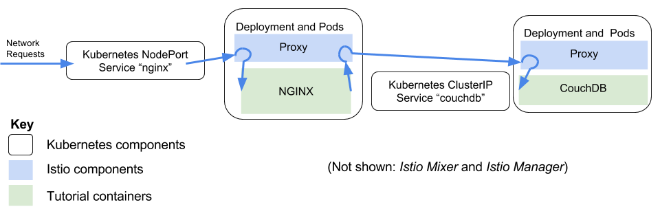

# Injecting Failures Systematically



Slow or unresponsive microservices can reveal defects in other system components.  Unhandled timeout
exceptions can cascade and affect user experience.

In this tutorial we will show advanced features of the Istio command line to inject delays into
a running system.

The Kubernetes-based implementation of Istio used in this tutorial works by injecting behavior
into Pods.  All Pods that participate in the service mesh are enabled by the addition of a proxy.
The _istioctl kube-inject_ subcommand can be used to apply the changes to a running Deployment.
Later we will show how to modify the YAML files used to deploy your application so that it comes
up immediately with the Istio mesh connection.

## Before you begin

This tutorial assumes you have deployed Istio on Kubernetes.  If you have not done so, please first
follow [the installation instructions](../INSTALL.md).

## Connecting microservices with Istio

This guide shows how to set up Istio and manipulate the proxy mesh to achieve useful behavior.
In this example we use *CouchDB* and *NGINX* as and demonstrate how to manipulate them:

* CouchDB is the official CouchDB Docker image
* NGINX is the offical NGINX Docker image.  We will configure it to redirect all calls to CouchDB

We will depart from the usual practice of creating a YAML description of Kubernetes pods and deploy
by directly running official builds.

First, let's start CouchDB and have it join the Istio service mesh

```
# Start the official Docker CouchDB image the container in a Kubernetes Pod.  5984 is the CouchDB port.
kubectl run couchdb --image=docker.io/library/couchdb --port 5984
```

The _kubectl get deployment_ subcommand simply creates a machine readable description of a service.  The _istioctl kube-inject_ subcommand creates a machine readable description of a service including Istio components.  By piping the commands together and sending the output to _kubectl apply_ we add Istio capabilities to our service.

```
# The CouchDB deployment must join the Istio service mesh.  Note that the pod will be recreated.
kubectl get deployment couchdb --output yaml | istioctl kube-inject --filename - --tag 2017-03-22-17.30.06 | kubectl apply -f -
```

For this tutorial an NGINX front-end will talk to CouchDB.  To enable communication we must expose the deployment as a Kubernetes Service.

```
kubectl expose deployment couchdb --name=couchdb
# Set the port name to http or http-* to enable Istio's rich HTTP routing
kubectl patch service couchdb --type='json' -p='[{"op": "add", "path": "/spec/ports/0/name", "value":"http"}]'
```

Because the CouchDB service we created is not exposed to the outside world for security reasons
we cannot test it from outside the cluster.  To verify that it is working correctly, we can run
a _curl_ command against couchdb:5984 *from inside the cluster* using the public _dockerqa/curl_
image from the Docker hub:

```
kubectl run -i --rm --restart=Never dummy --image=dockerqa/curl:ubuntu-trusty --command -- curl couchdb:5984
```

The output should include '{"couchdb":"Welcome"...'

Next we will start NGINX and configure it to proxy for the CouchDB service started in the previous step

```
# Create an NGINX service
kubectl run nginx --image=docker.io/nginx
# The NGINX deployment must join the Istio service mesh.
kubectl get deployment nginx --output yaml | istioctl kube-inject --filename - --tag 2017-03-22-17.30.06 | kubectl apply -f -
# Configure the NGINX to point to the CouchDB.  Note that this step is just for the demo.  You should
# not make changes to running containers in production.  This change is lost if the pod restarts.
NGINX_POD=$(kubectl get pods -l run=nginx --output jsonpath='{.items[*].metadata.name}')
kubectl exec -it $NGINX_POD /bin/bash -- -c \
   "echo 'server { listen 9080; location / { proxy_pass http://couchdb:5984; proxy_http_version 1.1;  } }' > /etc/nginx/conf.d/frontend.conf && /usr/sbin/nginx -s reload"
# (Note: The previous line should response with 'signal process started')
# Expose the NGINX
kubectl expose deployment nginx --type=NodePort --port 9080
```

To test from outside the cluster we will need the IP address of a Kubernetes node, as well
as the exposed NodePort port on that node.

```
# Get the IP address of the Kubernetes node
IP=$(kubectl get po -l infra=istio-ingress-controller -o jsonpath={.items[0].status.hostIP})
NGINX_NODEPORT=$(kubectl get service nginx --output jsonpath='{.spec.ports[0].nodePort}')
curl -i $IP:$NGINX_NODEPORT
```

At this point we have two services.  Both are wired through the Istio service mesh.  Both output the same data -- the CouchDB home JSON response.

## Manipulating the service mesh with route rules and destination polices

Istio has many advanced capabilities to control how network traffic flows between microservices.  One of the
most simple capabilities is to add a delay.

```
# First, create a rule file
cat <<EOF > /tmp/couch-5s-rule.yaml
type: route-rule
name: couch-5s-rule
spec:
  destination: couchdb.default.svc.cluster.local
  http_fault:
    delay:
      percent: 100
      fixed_delay: 5s
EOF

# Give the file to istioctl
istioctl create -f /tmp/couch-5s-rule.yaml
```

Wait a few seconds, then issue `curl $IP:$NGINX_NODEPORT` again.  This time it takes five seconds for *frontend* to reach *hello*.

```
time curl -i $IP:$NGINX_NODEPORT
```

The rule file defines a 5 second delay to be added to 100% of network traffic with the destination host name 
"couchdb.default.svc.cluster.local".  Why the long destination?  Although the NGINX configuration only uses "couchdb", the Istio configuration
requires the full format "&lt;host&gt;.&lt;namespace&gt;.svc.cluster.local" when running on Kubernetes.  The _kube-dns_ service on
Kubernetes sets up "<namespace>.svc.cluster.local" as the DNS search path so the names are equivelent.

## Cleanup

To remove the rules, deployments and services used in this tutorial:

```
istioctl delete route-rule couch-5s-rule
kubectl delete service couchdb
kubectl delete deployment couchdb
kubectl delete service nginx
kubectl delete deployment nginx
```


## Discussion

We have seen two web services, CouchDB and NGINX, connected via an Istio proxy mesh.  We have
used the proxy mesh to introduce a delay in all communications to CouchDB.  Normally Istio would
not be used to introduce delays &mdash; we use that feature for testing the behavior of microservice
applications.

## Next Steps

For a more detailed example, showing version upgrades and custom routing based on HTTP headers, try the
[bookinfo demo](../demos/apps/bookinfo/README.md).
