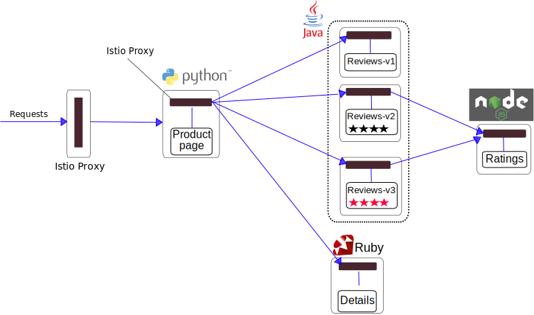

In this demo, we will deploy a simple app that displays information about a
book, similar to a single catalog entry of an online book store. Displayed
on the page is a description of the book, book details (ISBN, number of
pages, and so on), and a few book reviews.

The bookinfo application is broken into four separate microservices:

* *productpage*. The productpage microservice calls the *details* and *reviews* microservices to populate the page.
* *details*. The details microservice contains book information.
* *reviews*. The reviews microservice contains book reviews. It also calls the *ratings* microservice.
* *ratings*. The ratings microservice contains book ranking information that accompanies a book review.

There are 3 versions of the reviews microservice:

* Version v1 doesn't call the ratings service.
* Version v2 calls the ratings service, and displays each rating as 1 to 5 black stars.
* Version v3 calls the ratings service, and displays each rating as 1 to 5 red stars.

The end-to-end architecture of the application is shown below.


This application is polyglot, i.e., the microservices are written in different languages.

_Note: The following instructions assume that you have access to a kubernetes cluster. To install kubernetes locally, checkout [minikube](https://github.com/kubernetes/minikube)_


## Setup Istio

1. Clone the istio Github repository and start the core Istio services (the istio-manager, the istio-mixer, and the istio ingress controller).

```bash  
git clone https://github.com/istio/istio
cd istio
kubectl apply -f ./kubernetes/istio-install
```

   _Note: the current version of the bookinfo application MUST use the `default` Kubernetes namespace._
   
2. If you would like to view the metrics collected by Istio proxies, you need to install the Prometheus addon and start a Grafana service as well.
   
```bash
kubectl apply -f ./kubernetes/addons/
```
   
   The Grafana image provided as part of this demo contains a built-in Istio-dashboard that you can access from:

```
http://<grafana-svc-external-IP>:3000/dashboard/db/istio-dashboard
```

   > The addons yaml files contain services configured as type LoadBalancer. If services are deployed with type NodePort,
   > start kubectl proxy, and edit Grafana's Istio-dashboard to use the proxy. Access Grafana via kubectl proxy:*

   ```
   http://127.0.0.1:8001/api/v1/proxy/namespaces/<ns>/services/grafana:3000/dashboard/db/istio-dashboard
   ```

2. Install the [istioctl](../reference/istioctl.md) CLI, which provides a
   convenient way to apply routing rules and policies for upstreams. The
   [istio.VERSION](istio.VERSION) file includes the download location of 
   three OS-specific binaries: `istioctl-osx`, `istioctl-win.exe`,
   `istioctl-linux` targeted at Mac, Windows and Linux users
   respectively. Download the tool appropriate to your platform. For
   example, when running istioctl on a Mac, run the following commands:

   ```bash
   source ./istio.VERSION # set ISTIOCTL env variable
   wget -O /usr/local/bin/istioctl ${ISTIOCTL}/istioctl-osx
   chmod +x /usr/local/bin/istioctl
   ```

   > Note: If you already have a previously installed version of `istioctl`, make sure that
   > it is compatible with the manager image used in `demos/kubernetes/istio-manager.yaml`.
   > If in doubt, download again or add the `--tag` option when running `istioctl kube-inject`.
   > Invoke `istioctl kube-inject --help` for more details.


## Start the Application

1. Change your current working directory to the bookinfo application directory:

   ```bash
   cd demos/apps/bookinfo
   ```

1. Bring up the application containers:

   ```bash
   kubectl create -f <(istioctl kube-inject -f bookinfo.yaml)
   ```

   The above command creates the gateway ingress resource and launches
   the 4 microservices as described in the diagram above. The reviews
   microservice has 3 versions: v1, v2, and v3.  Note that in a
   realistic deployment, new versions of a microservice are deployed
   over time instead of deploying all versions
   simultaneously.

   Notice that the `istioctl kube-inject` command is used to modify the `bookinfo.yaml`
   file before creating the deployments. This injects the istio runtime proxy
   into kubernetes resources as documented [here](../reference/istioctl.md#kube-inject).
   Consequently, all of the microservices are now packaged with an Istio sidecar
   that manages incoming and outgoing calls for the service. The updated diagram looks
   like this:

   


1. Confirm that all services and pods are correctly defined and running:

   ```bash
   $ kubectl get services
   NAME                       CLUSTER-IP   EXTERNAL-IP   PORT(S)              AGE
   details                    10.0.0.31    <none>        9080/TCP             6m
   istio-ingress-controller   10.0.0.122   <pending>     80:32000/TCP         8m
   istio-manager              10.0.0.189   <none>        8080/TCP             8m
   istio-mixer                10.0.0.132   <none>        9091/TCP,42422/TCP   8m
   kubernetes                 10.0.0.1     <none>        443/TCP              14d
   productpage                10.0.0.120   <none>        9080/TCP             6m
   ratings                    10.0.0.15    <none>        9080/TCP             6m
   reviews                    10.0.0.170   <none>        9080/TCP             6m
   ```

   and

   ```bash
   $ kubectl get pods
   NAME                                        READY     STATUS    RESTARTS   AGE
   details-v1-1520924117-48z17                 2/2       Running   0          6m
   istio-ingress-controller-3181829929-xrrk5   1/1       Running   0          8m
   istio-manager-175173354-d6jm7               2/2       Running   0          8m
   istio-mixer-3883863574-jt09j                2/2       Running   0          8m
   productpage-v1-560495357-jk1lz              2/2       Running   0          6m
   ratings-v1-734492171-rnr5l                  2/2       Running   0          6m
   reviews-v1-874083890-f0qf0                  2/2       Running   0          6m
   reviews-v2-1343845940-b34q5                 2/2       Running   0          6m
   reviews-v3-1813607990-8ch52                 2/2       Running   0          6m
   ```

1. Determine the Gateway ingress URL

   ```bash
   $ export GATEWAY_URL=$(kubectl get po -l infra=istio-ingress-controller -o jsonpath={.items[0].status.hostIP}):$(kubectl get svc istio-ingress-controller -o jsonpath={.spec.ports[0].nodePort})
   $ echo $GATEWAY_URL
   192.168.99.100:32567
   ```
1. If you open the Bookinfo URL (http://$GATEWAY_URL/productpage) in your browser, you should see the bookinfo application productpage displayed.

## Traffic Management

### Content Based Routing

Since we have 3 versions of the reviews microservice running, we need to set the default route.
Otherwise if you access the application several times, you would notice that sometimes the output contains
star ratings. This is because without an explicit default version set, Istio will
route requests to all available versions of a service in a random fashion.

1. Set the default version for all microservices to v1.

   ```bash
   $ istioctl create -f route-rule-all-v1.yaml
   ```

   You can display the routes that are defined with the following command:

   ```bash
   $ istioctl list route-rule
   kind: route-rule
   name: ratings-default
   namespace: default
   spec:
     destination: ratings.default.svc.cluster.local
     precedence: 1
     route:
     - tags:
         version: v1
       weight: 100
   ---
   kind: route-rule
   name: reviews-default
   namespace: default
   spec:
     destination: reviews.default.svc.cluster.local
     precedence: 1
     route:
     - tags:
         version: v1
       weight: 100
   ---
   kind: route-rule
   name: details-default
   namespace: default
   spec:
     destination: details.default.svc.cluster.local
     precedence: 1
     route:
     - tags:
         version: v1
       weight: 100
   ---
   kind: route-rule
   name: productpage-default
   namespace: default
   spec:
     destination: productpage.default.svc.cluster.local
     precedence: 1
     route:
     - tags:
         version: v1
       weight: 100
   ---
   ```

   > Note: In the current Kubernetes implemention of Istio, the rules are stored in ThirdPartyResources.
   > You can look directly at the stored rules in Kubernetes using the `kubectl` command. For example,
   > the following command will display all defined rules:
   > ```bash
   > $ kubectl get istioconfig -o yaml
   > ```

   Since rule propagation to the proxies is asynchronous, you should wait a few seconds for the rules
   to propagate to all pods before attempting to access the application.

   If you open the Bookinfo URL (`http://$GATEWAY_URL/productpage`) in your browser,
   you should see the bookinfo application `productpage` displayed. Notice that the `productpage`
   is displayed with no rating stars since `reviews:v1` does not access the ratings service.

1. Route a specific user to `reviews:v2`

   Lets enable the ratings service for test user "jason" by routing productpage traffic to
   `reviews:v2` instances.

   ```bash
   $ istioctl create -f route-rule-reviews-test-v2.yaml
   ```

   Confirm the rule is created:

   ```bash
   $ istioctl get route-rule reviews-test-v2
   destination: reviews.default.svc.cluster.local
   match:
     httpHeaders:
       Cookie:
         regex: ^(.*?;)?(user=jason)(;.*)?$
   precedence: 2
   route:
   - tags:
       version: v2
   ```

   Log in as user "jason" at the `productpage` web page. You should now see ratings (1-5 stars) next
   to each review.

### Fault Injection

   To test our bookinfo application microservices for resiliency, we will _inject a 7s delay_
   between the reviews:v2 and ratings microservices. Since the _reviews:v2_ service has a
   10s timeout for its calls to the ratings service, we expect the end-to-end flow to
   continue without any errors.

1. Inject the delay

   Create a fault injection rule, to delay traffic coming from user "jason" (our test user).

   ```bash
   $ istioctl create -f destination-ratings-test-delay.yaml
   ```

   Confirm the rule is created:

   ```bash
   $ istioctl get route-rule ratings-test-delay
   destination: ratings.default.svc.cluster.local
   httpFault:
     delay:
       fixedDelaySeconds: 7
       percent: 100
   match:
     httpHeaders:
       Cookie:
         regex: "^(.*?;)?(user=jason)(;.*)?$"
   precedence: 2
   route:
   - tags:
       version: v1
   ```

   Allow several seconds to account for rule propagation delay to all pods.

1. Observe application behavior

   If the application's front page was set to correctly handle delays, we expect it
   to load within approximately 7 seconds. To see the web page response times, open the
   *Developer Tools* menu in IE, Chrome or Firefox (typically, key combination _Ctrl+Shift+I_
   or _Alt+Cmd+I_) and reload the `productpage` web page.

   You will see that the webpage loads in about 6 seconds. The reviews section will show
   *Sorry, product reviews are currently unavailable for this book*.

   The reason that the entire reviews service has failed is because our bookinfo application
   has a bug. The timeout between the productpage and reviews service is less (3s + 1 retry = 6s total)
   than the timeout between the reviews and ratings service (10s). These kinds of bugs can occur in
   typical enterprise applications where different teams develop different microservices
   independently. Istio's fault injection rules help you identify such anomalies without
   impacting end users.

   > Notice that we are restricting the failure impact to user "jason" only. If you login
   > as any other user, you would not experience any delays.

  **Fixing the bug:** At this point we would normally fix the problem by either increasing the
  productpage timeout or decreasing the reviews to ratings service timeout,
  terminate and restart the fixed microservice, and then confirm that the `productpage`
  returns its response without any errors.
  (Left as an exercise for the reader - change the delay rule to
  use a 2.8 second delay and then run it against the v3 version of reviews.)

  However, we already have this fix running in v3 of the reviews service, so
  we can next demonstrate deployment of a new version.

### Percentage-based Traffic Split

Now that we have tested the reviews service, fixed the bug and deployed a
new version (`reviews:v3`), lets route all user traffic from `reviews:v1`
to `reviews:v3` in two steps.

First, transfer 50% of traffic from `reviews:v1` to `reviews:v3` with the following command:

```bash
   $ istioctl replace -f route-rule-reviews-50-v3.yaml
```

> Notice that we are using `istioctl replace` instead of `create`.

To see the new version you need to either Log out as test user "jason" or delete the test rules
that we created exclusively for him:

```bash
   $ istioctl delete route-rule reviews-test-v2
   $ istioctl delete route-rule ratings-test-delay
```

You should now see *red* colored star ratings approximately 50% of the time when you refresh
the `productpage`.

> Note: With the Envoy sidecar implementation, you may need to refresh the `productpage` 100 times
> to see the proper distribution.

When we are confident that our Bookinfo app is stable, we route 100% of the traffic to `reviews:v3`:

```bash
   $ istioctl replace -f route-rule-reviews-v3.yaml
```

You can now log in to the `productpage` as any user and you should always see book reviews
with *red* colored star ratings for each review.

## Policy Enforcement

### Rate Limiting [WIP]

Now we'll pretend that `ratings` is an external service for which we are paying (like going to rotten tomatoes),
so we will set a rate limit on the service such that the load remains under the Free quota (5q/s):

```bash
   $ # (TODO) istioctl create -f mixer-rule-ratings-ratelimit.yaml
   $ kubectl apply -f ../../mixer-config-quota-bookinfo.yaml
```

We now generate load on the `productpage` with the following command:

```bash
   $ while true; do curl -s -o /dev/null http://$GATEWAY_URL/productpage; done
```

If you now refresh the `productpage` you'll see that while the load generator is running
(i.e., generating more than 5 req/s), we stop seeing stars.

## Cleanup

1. Delete the routing rules and terminate the application and control plane pods

   ```bash
   $ ./cleanup.sh
   ```

1. Optionally shut down the control plane services using the uninstall instructions [here](../../../kubernetes/README.md).

1. Confirm shutdown

   ```bash
   $ istioctl list route-rule   #-- there should be no more routing rules
   $ kubectl get pods           #-- the bookinfo, and (optionally) control plane services, should be deleted
   No resources found.
   ```
