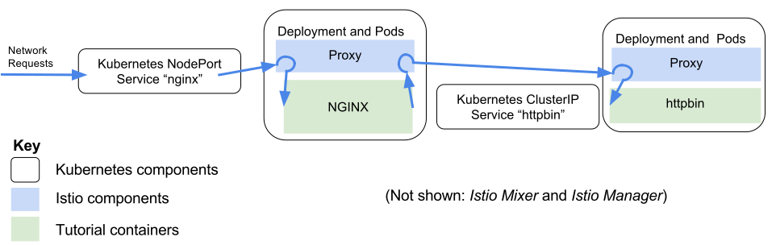





Slow or unresponsive microservices can reveal defects in other system components.  Unhandled timeout
exceptions can cascade and affect user experience.

This task shows advanced features of the Istio command line to inject timeouts into
a running system.

The Kubernetes-based implementation of Istio used in this task works by injecting behavior
into pods.  All pods that participate in the service mesh are enabled by the addition of a proxy.
We will inject HTTP timeout behavior by giving a new rule to the Istio Manager.  The proxy will
implement the timeout.





This task assumes you have deployed Istio on Kubernetes.  If you have not done so, please first
clone the istio GitHub repository and start the core Istio services (the istio-manager, the istio-mixer, and the istio ingress controller).

```shell
git clone https://github.com/istio/istio
cd istio
kubectl apply -f ./kubernetes/istio-install
```

You should also have installed the [istioctl]({{site.baseurl}}/reference/istioctl.html) CLI.




## Connecting microservices with Istio

This guide shows how to set up Istio and manipulate the service mesh to achieve useful behavior.
In this example we use *[httpbin](https://httpbin.org)* and *NGINX* and demonstrate how to manipulate them:

* [citizenstig/httpbin](https://hub.docker.com/r/citizenstig/httpbin/) is a popular Docker image for httpbin.
* NGINX is the offical NGINX Docker image.  We will configure it to redirect all calls to httpbin.

First, let's start httpbin and have it join the Istio service mesh

```shell
# Start the citizenstig/httpbin image in a Kubernetes Pod.  8000 is the httpbin port.
source ../istio.VERSION
kubectl create -f <(istioctl kube-inject -f {{site.baseurl}}/docs/tasks/httpbin.yaml)
```

The _istioctl kube-inject_ subcommand creates a machine readable description of a service including Istio components.  By sending the kube-inject output to _kubectl create_ we add Istio capabilities to our service.

For this talk an NGINX front-end will talk to httpbin.

Because the httpbin service we created is not exposed to the outside world for security reasons
we cannot test it from outside the cluster.  To verify that it is working correctly, we can run
a _curl_ command against httpbin:8000 *from inside the cluster* using the public _dockerqa/curl_
image from the Docker hub:

```shell
kubectl run -i --rm --restart=Never dummy --image=dockerqa/curl:ubuntu-trusty --command -- curl --silent httpbin:8000/html
kubectl run -i --rm --restart=Never dummy --image=dockerqa/curl:ubuntu-trusty --command -- curl --silent httpbin:8000/status/500
time kubectl run -i --rm --restart=Never dummy --image=dockerqa/curl:ubuntu-trusty --command -- curl --silent httpbin:8000/delay/5
```

Next we will start NGINX and configure it to proxy for the httpbin service started in the previous step

```shell
kubectl create -f <(istioctl kube-inject -f {{site.baseurl}}/docs/tasks/nginx-httpbin.yaml)
```

To test from outside the cluster we will need the IP address of a Kubernetes node, as well
as the exposed NodePort port on that node.

```shell
# Get the IP address of the Kubernetes node
IP=$(kubectl get po -l infra=istio-ingress-controller -o jsonpath={.items[0].status.hostIP})
NGINX_NODEPORT=$(kubectl get service nginx --output jsonpath='{.spec.ports[0].nodePort}')
curl -i $IP:$NGINX_NODEPORT/html
curl -i $IP:$NGINX_NODEPORT/status/500
time curl -i $IP:$NGINX_NODEPORT/delay/5
```

At this point we have two services.  Both are wired through the Istio service mesh.  Both output the same data.

## Manipulating the service mesh with route rules and destination polices

Istio has many advanced capabilities to control how network traffic flows between microservices.  One of the
simplest capabilities is to add a timeout.

```shell
# First, create a rule file
cat <<EOF > /tmp/httpbin-3s-rule.yaml
type: route-rule
name: httpbin-3s-rule
spec:
  destination: httpbin.default.svc.cluster.local
  http_req_timeout:
    simple_timeout:
      timeout_seconds: 3
EOF

# Give the file to istioctl
istioctl create -f /tmp/httpbin-3s-rule.yaml
```

Wait a few seconds, then issue `time curl -i $IP:$NGINX_NODEPORT/delay/5` again.  This time the response appears after
three seconds.  Although _httpbin_ was waiting 5 seconds, Istio cut off the request at 3 seconds.

## Cleanup

To remove the rules, deployments and services used in this task:

```shell
istioctl delete route-rule httpbin-3s-rule
kubectl delete -f {{site.baseurl}}/docs/tasks/httpbin.yaml
kubectl delete -f {{site.baseurl}}/docs/tasks/nginx-httpbin.yaml
```


## Discussion

We have seen two microservices, httpbin and NGINX, connected via an Istio service mesh.  We have
used the service mesh to introduce a maximum delay using a timeout in all communications to httpbin.




