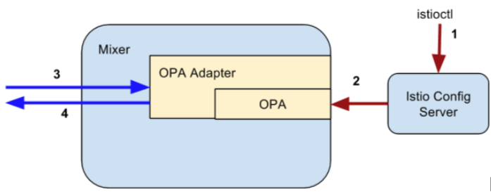

# Opa adapter

The OPA [mixer adapter](https://istio.io/docs/concepts/policy-and-control/mixer.html#adapters) is an implementation of [authorization template](https://github.com/istio/istio/tree/master/mixer/template/authorization)
that evaluates the client request using the [Open Policy Agent](http://www.openpolicyagent.org/) engine.

Opa adapter embedded the [Open Policy Agent](http://www.openpolicyagent.org/) as a library inside a Mixer adapter.



The adapter is responsible for (1) instantiating an [Open Policy Agent](http://www.openpolicyagent.org/) instance,
(2) passing the parameters to [Open Policy Agent](http://www.openpolicyagent.org/) and getting the evaluation results from OPA at runtime

## Configuration flow (1 and 2 in the above figure):

  1. Service producer sets authorization rules via istioctl. The rules are saved in Istio Configuration server.
  1. The authorization adapter fetches the rules and passes to [Open Policy Agent](http://www.openpolicyagent.org/).

## Runtime flow (3 and 4 in the above figure):

  1. The request context is defined by the [authorization template](https://github.com/istio/istio/blob/master/mixer/template/authorization/template.proto), which has two parts, "subject" defines the client identity, and "action" defines how the resource is accessed.
  1. [Open Policy Agent](http://www.openpolicyagent.org/) evaluates the request context against the rules, and returns the result.

## Configuration

To activate an OPA adapter, operators need to configure the
[authorization template](https://github.com/istio/istio/blob/master/mixer/template/authorization/template.proto) and the
[opa adapter](https://github.com/istio/istio/blob/master/mixer/adapter/opa/config/config.proto).

```protobuf
message Params {
 // List of OPA policies
 repeated string policy = 1;

 // Query method to check, data.<package name>.<method name>
 string check_method = 2;

 // Close the client request when adapter has a issue.
 // If failClose is set to true and there is a runtime error,
 // instead of disabling the adapter, close the client request

 bool fail_close = 3;
}
```

## Example configuration

```yaml
apiVersion: "config.istio.io/v1alpha2"
kind: rule
metadata:
 name: authorization
 namespace: istio-config-default
spec:
 selector: "true"
 actions:
 - handler: opaHandler.opa.istio-config-default
   instances:
   - authzInstance.authorization.istio-config-default

---

apiVersion: "config.istio.io/v1alpha2"
kind: authorization
metadata:
 name: authzInstance
 namespace: istio-config-default
spec:
 subject:
   user: source.uid | ""
 action:
   namespace: destination.namespace | "default"
   service: destination.service | ""
   method: request.method | ""
   path: request.path | ""

---

apiVersion: "config.istio.io/v1alpha2"
kind: opa
metadata:
 name: opaHandler
 namespace: istio-config-default
spec:
 policy:
   - |+
     package mixerauthz
    policy = [
      {
        "rule": {
          "verbs": [
            "storage.buckets.get"
          ],
          "users": [
            "bucket-admins"
          ]
        }
      }
    ]

    default allow = false

    allow = true {
      rule = policy[_].rule
      input.subject.user = rule.users[_]
      input.action.method = rule.verbs[_]
    }
 checkMethod: "data.mixerauthz.allow"
 failClose: true
```
