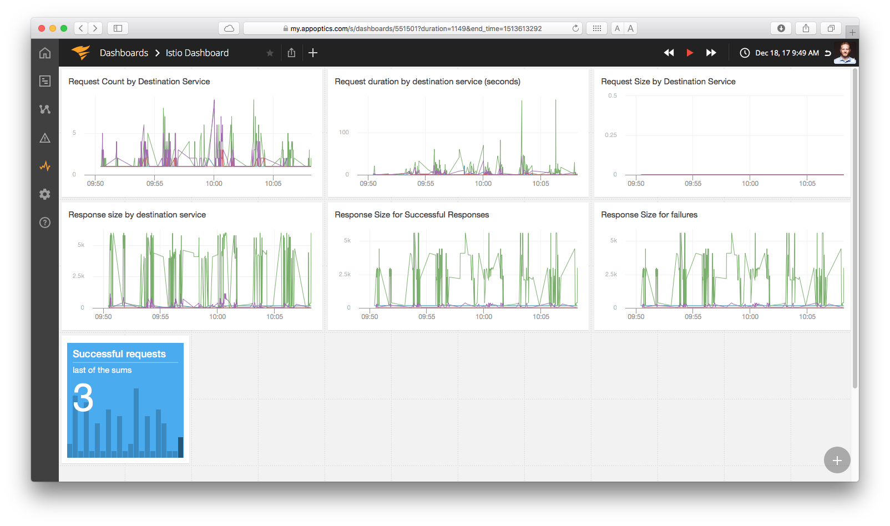

# Istio Mixer Adapter
An Istio Mixer adapter for integration with AppOptics and Papertrail. As a SolarWinds Innovation Project, this adapter is supported in a best-effort fashion.

## Purpose
This adapter allows you to bring your services’ logs and metrics collected through Istio Mixer into Papertrail and AppOptics, respectively, to enable all of the advanced search and organizational capabilities, giving users a broader look at their app’s performance. As apps become more distributed with microservices, it’s important to continue finding ways to help provide tools to show relevant metrics on both overall and isolated performance.

### AppOptics integration screenshot

### Papertrail integration screenshot

# Questions/Comments?
Please [open an issue](https://github.com/solarwinds/istio-adapter/issues/new), we'd love to hear from you. As a SolarWinds Innovation Project, this adapter is supported in a best-effort fashion.
