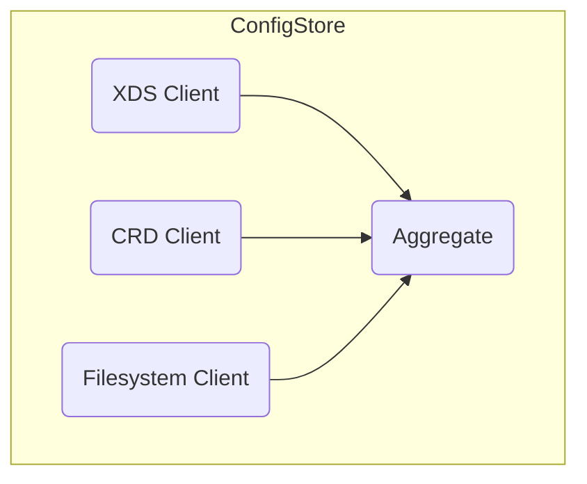
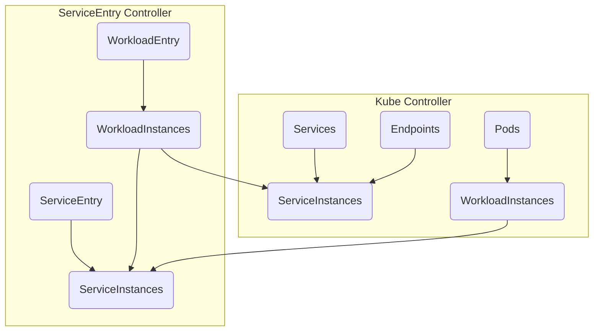
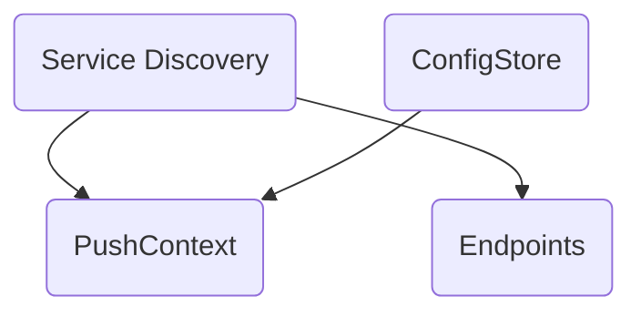
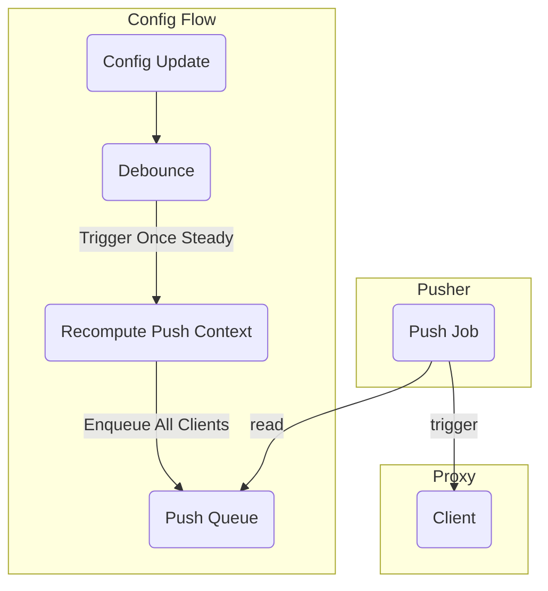

# Architecture of Istiod

This document describes the high level architecture of the Istio control plane, Istiod.
Istiod is structured as a modular monolith, housing a wide range of functionality from certificate signing, proxy configuration (XDS), traditional Kubernetes controllers, and more.

## Proxy Configuration

Istiod's primary role - and most code - is to dynamically configure proxies (Envoy sidecars and ingress, gRPC, ztunnel, and more). This roughly consists of 3 parts:
1. Config ingestion (inputs to the system)
1. Config translation
1. Config serving (XDS)

### Config Ingestion

Istio reads from over 20 different resources types, and aggregates them together to build the proxy configuration. These resources can be sourced from Kubernetes (via watches), files, or over xDS; Kubernetes is by far the most common usage, though.

Primarily for historical reasons, ingestion is split into a few components.

#### ConfigStore

The `ConfigStore` reads a variety of resources and exposes them over a standard interface (Get, List, etc). These types are wrapped in a common `config.Config` struct, contrasting with typical Kubernetes clients which use per-resource types. The most common is reading from Kubernetes via the `crdclient` package.

#### ServiceDiscovery

The other primary interface is the ServiceDiscovery. Similar to ConfigStore, this aggregates over a variety of resources. However, it does not provide generic resource access, and instead precomputes a variety of service-oriented internal resources, such as `model.Service` and `model.ServiceInstance`.

This is composed of two controllers - one driven from core Kubernetes types ("Kube Controller") and one by Istio types ("ServiceEntry controller").

For the most part this is fairly straight forward. However, we support `ServiceEntry` selecting `Pod`, and `Service` selecting `WorkloadEntry`, which leads to cross-controller communication.

Note: the asymmetry with `Pods` not contributing to Kube controller's `ServiceInstances` is due to the use of `Endpoints` which itself is derived from `Pod` from Kubernetes core.

#### PushContext

`PushContext` is an immutable snapshot of the current state of the world. It is regenerated (usually partially) on each configuration push (more on this below). Due to being a snapshot, most lookups are lock-free.

`PushContext` is built up by querying the above layers. For some simple use cases, this is as simple as storing something like `configstore.List(SomeType)`; in this case, the only difference from directly exposing the configstore is to snapshot the current state. In other cases, some pre-computations and indexes are computed to make later accesses efficient.

#### Endpoints

Endpoints have an optimized code path, as they are by far the most frequently updated resource - in a steady cluster, this will often be the *only* change, caused by scale up/down.

As a result, they do not go through `PushContext`, and changes do not trigger a `PushContext` recomputation. Instead, the current state is incrementally computed based on events from `ServiceDiscovery`.

#### Conclusion

Overall, the high level config ingestion flow:

### Config Translation

Config Translation turns the above inputs into the actual types consumed by the connected XDS clients (typically Envoy). This is done by `Generators`, which register a function to build a given type. For example, there is a `RouteGenerator` responsible for building `Routes`. Along with the core Envoy XDS types, there are a few custom Istio types, such as our `NameTable` type used for DNS, as well as debug interfaces.

`Generators` get as input the `Proxy` (a representation of the current client), the current `PushContext` snapshot, and a list of config updates that caused the change.

The `Proxy` as an input parameter is important, and a major distinction from some other XDS implementations. We are not able to statically translate inputs to XDS without per-client information. For example, we rely on the client's labels to determine the set of policies applied. While this is necessary to implement Istio's APIs, it does limit performance substantially.

#### Caching

Config translation typically takes the overwhelming majority of Istiod's resource usage. In particular, protobuf encoding. As a result, caching has been introduced, storing the already encoded `protobuf.Any` for a given resource.

This caching depends on declaring all inputs to the given generator as part of the cache key. This is extremely error-prone, as there is nothing preventing generators from consuming inputs that are *not* part of the key. When this happens, different clients will non-deterministically get incorrect configuration. This type of bug has historically resulted in CVEs.

There are a few ways to prevent these:
* Only pass in to the generation logic the cache key itself, so no other unaccounted inputs can be used. Unfortunately, this has not been done for any generators today.
* Be very, very careful.
* The cache has a builtin test, enabled with `UNSAFE_PILOT_ENABLE_RUNTIME_ASSERTIONS=true`, that runs in CI. This will panic if any key is written to with a different value.

#### Partial Computations

Along with caching, partial computations are a critical performance optimization to ensure that we do not need to build (or send) every resource to every proxy on every change. This is discussed more in the Config Serving section.

### Config Serving

Config serving is the layer that actually accepts proxy clients, connected over bidirectional gRPC streams, and serve them the required configuration.

We will have two triggers for sending config - requests and pushes.

#### Requests

Requests come from the client specifically asking for a set of resources. This could be requesting the initial set of resources on a new connection, or from a new dependency. For example, a push of `Cluster X` referencing `Endpoint Y` may lead to a request for `Endpoint Y` if it is not already known to the client.

Note that clients can actually send three types of messages - requests, ACKs of previous pushes, and NACKs of previous pushes. Unfortunately, these are not clearly distinguished in the API, so there is some logic to split these out (`shouldRespond`).

#### Pushes

A push occurs when Istiod detects an update of some set of configuration is needed. This results in roughly the same result as a Request (new configuration is pushed to the client), and is just triggered by a different source.

Various components described in Config Ingestion can trigger a Config Update. These are batched up ("debounced"), to avoid excessive activity when many changes happen in succession, and eventually enqueued in the Push Queue.

The Push Queue is mostly a normal queue, but it has some special logic to merge push requests for each given proxy. This results in each proxy having 0 or 1 outstanding push requests; if additional updates come in the existing push request is just expanded.

Another job polls this queue and triggers each client to start a push.

At a high level, each client job will find the correct generator for the request, generate the required configuration, and send it.

#### Optimizations

A naive implementation would simply regenerate all resources, of all subscribed types, for each client, on any configuration change. However, this scales poorly. As a result, we have many levels of optimizations to avoid doing this work.

First, we have a concept of a `Full` push. Only `Full` pushes will recompute `PushContext` on change; otherwise this is skipped and the last `PushContext` is re-used. Note: even when `Full`, we try to copy as much from the previous `PushContext` as possible. For example, if only a `WasmPlugin` changed, we would not recompute services indexes.
Note: `Full` only refers to whether a `PushContext` recomputation is needed. Even within a `Full` push, we keep track of which configuration updates triggered this, so we could have "Full update of Config X" or "Full update of all configs".

Next, for an individual proxy we will check if it could possibly be impacted by the change. For example, we know a sidecar never is impacted by a `Gateway` update, and we can also look at scoping (from `Sidecar.egress.hosts`) to further restrict update scopes.

Once we determine the proxy may be impacted, we determine which *types* may be impacted. For example, we know a `WasmPlugin` does not impact the `Cluster` type, so we can skip generating `Cluster` in this case. Warning: Envoy currently has a bug that *requires* `Endpoints` to be pushed any time the corresponding `Cluster` is pushed, so this optimization is intentionally turned off in this specific case.

Finally, we determine which subset of the type we need to generate. XDS has two modes - "State of the World (SotW)" and "Delta". In SotW, we generally need to generate all resources of the type, even if only one changed. Note that we actually need to *generate* all of them, typically, as we do not store previously generated resources (mostly because they are generated per-client). This also means that whenever we are determining if a change is required, we are doing this based on careful code analysis, not at runtime.
Despite this expectation in SotW, due to a quirk in the protocol we can actually enable one of our most important optimizations. XDS types form a tree, with CDS and LDS the root of the tree for Envoy. For root types, we *must* always generate the full set of resources - missing resources are treated as deletions.
However, all other types *cannot* be deleted explicitly, and instead are cleaned up when all references are removed. This means we can send partial updates for non-root types, without deleting unsent resources. This effectively allows doing delta updates over SotW. This optimization is critical for our endpoints generator, ensuring that when a pod scales we only need to update the endpoints within that pod.

Istio currently supports both SotW and Delta protocol. However, the delta implementation is not yet optimized well, so it performs mostly the same as SotW.
