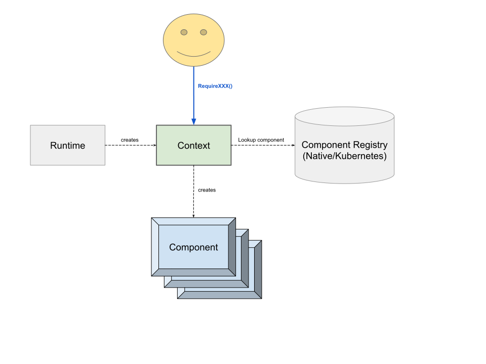

# Istio Test Framework Developer Guide

This document describes the overall architecture of the Istio test framework and describes how to extend its capabilities.

## Overview

At a high-level, the framework is simple:

The `Runtime` creates the `Context`, which is the main API to the test code. The `Runtime` chooses the appropriate 
component `Registry` based on the flags and then provides it to the `Context`. When the test `Require`s components,
the `Context` looks them up in the `Registry`, which provides factories for the components. 

## Extending the Framework

### Adding a API

To add a new component API:

1. Add the Go file for the interface to [api/components](api/components), along with a `GetXXX` function for extracting that component from the context.
2. Add an ID for the component to [ids.go](api/ids/ids.go).
3. Add a Descriptor for the component to [descriptors.go](api/descriptors/descriptors.go).
    - If a single environment can support multiple versions of a component (e.g. real vs fake), specify the `Variant` to distinguish between the two.
    - At a minimum, the descriptor should require `ids.Environment`.

### Adding a Component

Once you have a component API, you can add an implementation as follows:

1. Create the directory `runtime/components/<component_name>` which will hold the implementation.
2. Under that directory, write a Go class implementing the component API and write a factory method for constructing it.
3. Register your component with one of the environment registries defined in [registries.go](runtime/registries/registries.go).

### Adding an Environment

Environments are just slightly specialized components, so the process for adding an environment is similar. The interface for
Environment is part of the runtime and is located at [runtime/api/environment.go].

To add a new environment, follow these steps:

1. Create the directory `runtime/components/environment/<environment>` which will hold the implementation.
2. Under that directory, write a Go class implementing the [Environment](runtime/api/environment.go) API and write a factory method for constructing it.
3. In [registries.go](runtime/registries/registries.go) add a new variable for the environment. For example: `MyEnv = newEnvironment(descriptors.MyEnvironment, myenv.NewEnvironment)`.
4. In [registries.go](runtime/registries/registries.go) register any components with the new environment.
