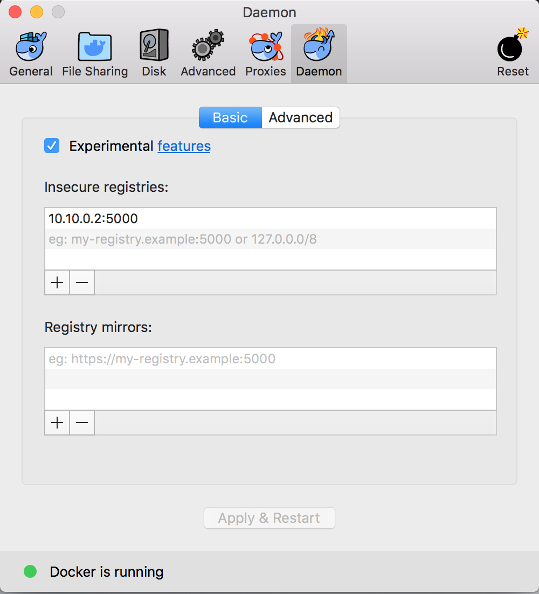

# Benefits:
1. Set up a local vagrant VM Environment once and run E2E tests on local machine, so you can test and debug locally.
1. No need to worry about kubernetes cluster setup.

# Prereqs:
1. Set up Istio Dev envrionment using https://github.com/istio/istio/wiki/Dev-Guide.

1. Install
  * [virtual box](https://www.virtualbox.org/wiki/Downloads) - Verify `virtualbox` command opens up a virtual box window
  * [docker](https://docs.docker.com/) - Verify `docker version` returns version >= 18.03.0-ce
  * [vagrant](https://www.vagrantup.com/downloads.html) - Verify `vagrant -v` returns version >= Vagrant 2.0.3
  * [kubectl](https://kubernetes.io/docs/tasks/tools/install-kubectl) - Verify `kubectl version` returns both server and client versions
  * [curl](https://curl.haxx.se/) - Verify `curl --help` prints the help information.

You can run the following script to check/install of all pre-requisites, or use it as a reference to install them manually.
(This requires installation of [Homebrew](https://brew.sh) on macOS or debian based Linux distributions)

```bash
sh install_prereqs.sh
```

# Steps
## 1. Set up Vagrant Environment
```bash
sh setup_vm.sh
```

## 2. Set up Docker daemon and kubectl on Host
```bash
sh setup_host.sh
```
**MacOS ONLY** Set up docker daemon in Docker UI.
1. Open Docker and go to Preferences
1. Click on the Daemon tag
1. Add `10.10.0.2:5000` to the "Insecure registries"
1. Click the `Apply and Start` button in the bottom to restart Docker with the new setting



## 3. Build istio images
Push images from your local dev environment to the local registry on vagrant vm:
```bash
sh setup_test.sh
```
You should push new images whenever you modify istio source code.

## 4. Run tests!
### On Host
You can issue test commands on your host machine.
E.g.
```bash
cd $ISTIO/istio
make e2e_simple E2E_ARGS="--use_local_cluster" HUB=10.10.0.2:5000 TAG=latest
```
Note the special arguments like **E2E_ARGS**, **HUB**, and **TAG**. They are required to run these tests with the local cluster and a local registry inside the VM. And you can run multiple E2E tests sequentially against the same VM.

### On VM
You can also ssh to VM and issue test commands within the VM.
E.g.
```bash
cd $ISTIO/istio/vagrant-kubernetes-istio
vagrant ssh
# Inside VM
cd $ISTIO/istio
make e2e_simple E2E_ARGS="--use_local_cluster"
```

### Debug with Delve
You can try debugging Istio with debugger tool. vm_setup.sh already installs Delve into VM for us. To use Delve, we need process id of the binary we want to debug.
For example, if you want to debug a test, run that test in your host/vm.
```bash
# In the VM/Host
make e2e_simple E2E_ARGS="--use_local_cluster --skip_cleanup" HUB=10.10.0.2:5000 TAG=latest
```
Now, find the pid of the process say pilot-discovery that you want to debug.
```bash
vagrant ssh
ps -ef | grep pilot-discovery
```
Then, you can run Delve
```bash
sudo -E env "PATH=$PATH" dlv attach <pid of pilot-discovery>
```
For more information, please check [Debug an Istio container with Delve](https://github.com/istio/istio/wiki/Dev-Guide#debug-an-istio-container-with-delve)

# Cleanup
To save the vagrant VM status:
```bash
vagrant halt
```

To destroy the VM:
```bash
vagrant destroy
``` 

To cleanup host settings only (restore kubectl and remove docker daemon setup)
```bash
sh cleanup_host.sh
```
**MacOS ONLY** 
1. Open Docker and go to Preferences
1. Click on the Daemon tag
1. Remove `10.10.0.2:5000` from the "Insecure registries"
1. Click the `Apply and Start` button in the bottom to restart Docker with the new setting

# Troubleshooting
Please refer [Troubleshooting](Troubleshooting.md) doc for information on this.
