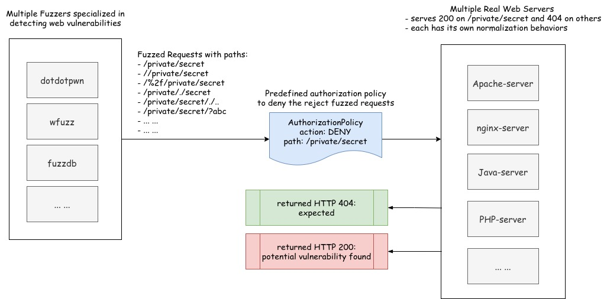

# Fuzz test for security policy

The directory includes fuzz tests for security policy:

- request authentication: test potential bypass and crash in the JWT filter caused by malformed JWT token and common
  vulnerabilities in JWT validation.

- authorization policy: test potential policy bypass issues caused by path normalization issues in Istio and Envoy.

This test is currently optional and not executed in the normal integration test. It is recommended to run the test
before each new Istio release and make sure all fuzz tests pass.

## Overview



The fuzz test uses specialized web vulnerability fuzzers ([jwt_tool](https://github.com/ticarpi/jwt_tool),
[dotdotpwn](https://github.com/wireghoul/dotdotpwn)) and [wfuzz](https://github.com/xmendez/wfuzz) to generate a
large number of fuzzed requests. The mutation is based on a predefined path (`/private/secret.html`) that should be
rejected by either the request authentication or the authorization policy.

The test backend uses real Web servers (`apache`, `nginx` and `tomcat`) configured to serve at the above predefined path.
If a fuzzer generated request successfully gets the data at the predefined path, it means a policy bypass has happened
otherwise it should have been rejected with 403 by the policy.

We use the real backends instead of the existing test apps in order to test against unknown new normalization behaviors
in real backend servers.

The fuzz test is configured to run every day at 07:00AM UTC, check the results in
[integ-security-fuzz-k8s-tests_istio_periodic](https://prow.istio.io/?job=integ-security-fuzz-k8s-tests_istio_periodic).

## Usage

1. Run the test with existing Istio deployment:

    ```bash
    go test ./tests/integration/security/fuzz/... -p 1 -v -tags="integfuzz integ" -test.run "TestFuzzAuthorization|TestRequestAuthentication" \
      --istio.test.nocleanup --istio.test.env kube  --istio.test.kube.deploy=false - -timeout 30m \
      --istio.test.pullpolicy=IfNotPresent --istio.test.kube.loadbalancer=false --log_output_level=tf:debug
    ```

1. Wait for the test to complete and check the results, the test usually takes about 5 minutes.

## Next Steps

1. Support authorization ALLOW policy in addition to the DENY policy.

1. Cover more fields in the authorization policy.
