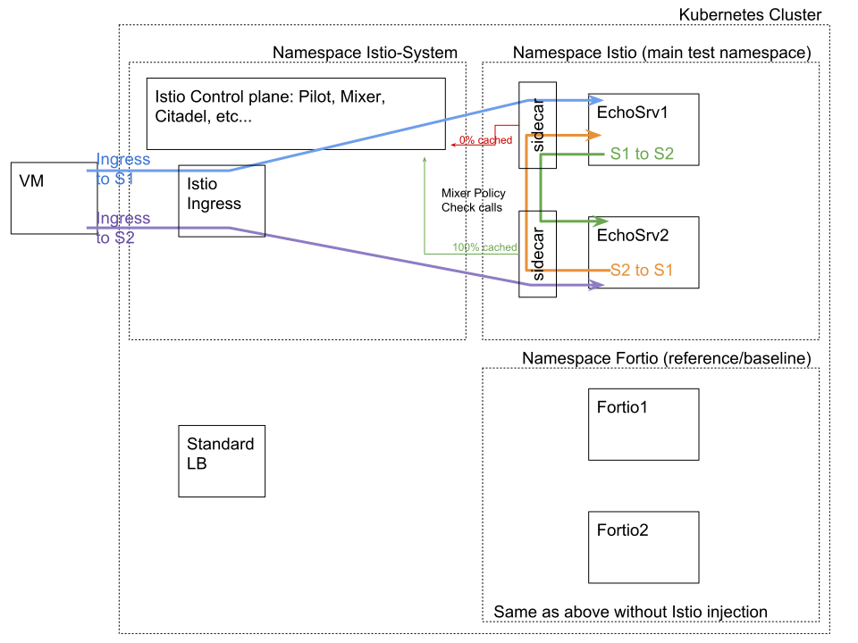

# Istio Load Testing User Guide
### Introduction
This guide provides step-by-step instructions for using the `setup_perf_cluster.sh` load testing script.
The script deploys a GKE cluster, an Istio service mesh and a GCE VM. The script then runs [Fortio](https://github.com/istio/fortio/)
on the VM, 2 pods within the cluster (non-Istio) and 2 pods within the Istio mesh. The following diagram provides
additional details of the deployment:



The deployment provides a basis for Istio performance characterization. Fortio is used to perform load testing,
graphing results and as a backend echo server.

### Download a Release or Clone Istio

From release (either [official](https://github.com/istio/istio/releases) or [dailies](https://github.com/istio/istio/wiki/Daily-builds)):
```
curl -L https://git.io/getLatestIstio | sh -  # or download the daily TGZ
```

From source:
```
$ git clone https://github.com/istio/istio.git && cd istio
```

### Prepare the Istio Deployment Manifest and Istio Client

__Option A:__ (From release) Make sure `istioctl` is in your path is the one matching the downloaded release.

For instance, in `~/tmp/istio-0.5.0/` run:
```
export PATH=`pwd`/bin:$PATH
# check 'which istioctl' and 'istioctl version' returns the correct version
```
For versions before 0.5.0 (the tools/ directory is now part of the release)
```
$ ln -s $GOPATH/src/istio.io/istio/tools
```
If you want to get newer version of the tools, you can `rm -rf tools/` and do the symlink above to use your updated/newer script.

__Option B:__ (From source) Build the deployment manifest and `istioctl` binary:
```
$ ./install/updateVersion.sh # This step is only needed when using Istio from source.
```
Follow the steps in the [Developer Guide](https://github.com/istio/istio/blob/master/DEV-GUIDE.md) to build the `istioctl` binary. Make sure it does `istioctl kube-inject` producing the HUB/TAG you expect.
Make the kubectl binary executable.
```
$ chmod +x ./istioctl
```

Move the binary in to your PATH.
```
$ mv ./istioctl /usr/local/bin/istioctl
```


### Set Your Google Cloud Credentials (optional/one time setup)
This is not necessary if you already have working `gcloud` commands and you
did `gcloud auth login` at least once.
```
$ gcloud auth login
# Or
$ export GOOGLE_APPLICATION_CREDENTIALS=/my/gce/creds.json
```
If you do not have a Google Cloud account, [set one up](https://cloud.google.com/).

### Optional: Customize the Deployment
The `setup_perf_cluster.sh` script can be customized. View the script and modify the default variables if needed.
For example, to update the default gcloud zone (us-east4-b):
```
$ ZONE=us-west1-a
```
If you change either the `PROJECT` or the `ZONE`, make sure to run `update_gcp_opts` before calling the other functions.

The script tries to guess your `PROJECT` but it's safer to set it explicitly. (and use a new empty project if possible)

### Source the Script
```
$ source tools/setup_perf_cluster.sh
```
__Note:__ `setup_perf_cluster.sh` can be used as a script or sourced and functions called interactively.
Inside Google, you may need to rerun setup_vm_firewall multiple times.

### Run the Functions
The output of `source tools/setup_perf_cluster.sh` provides a list of available functions or
you can view the functions from within the `setup_perf_cluster.sh` script. The most common workflow is:
```
$ setup_all
Obtaining latest ubuntu xenial image name... (takes a few seconds)...
<SNIP>
### Running: istioctl create -n istio -f tools/cache_buster.yaml
Created config denier/istio/denyall at revision 881
Created config checknothing/istio/denyrequest at revision 882
Created config rule/istio/mixercachebuster at revision 883
```
The deployment is now complete. You can verify the deployment using standard `kubectl` commands:
```
$ kubectl get po --all-namespaces
NAMESPACE      NAME                                                   READY     STATUS    RESTARTS   AGE
fortio         fortio1-1966733334-xj5f6                               1/1       Running   0          8m
fortio         fortio2-3044850348-v5f74                               1/1       Running   0          8m
istio-system   istio-ca-1363003450-gvtmn                              1/1       Running   0          7m
istio-system   istio-ingress-1732553340-gv41r                         1/1       Running   0          7m
istio-system   istio-mixer-3192291716-psskv                           3/3       Running   0          8m
istio-system   istio-pilot-3663920167-4ns3g                           2/2       Running   0          7m
<SNIP>
```
You can now run the performance tests, either from the command line or interactively using the UIs (see next section). For command lines there are a couple of examples in the `run_tests` function:

```
$ run_tests
```

The first test case uses the default loadbalancer and no Istio mesh or Istio Ingress Controller. The following command tells
Fortio on the VM to run a load test against the Fortio echo server running in the Kubernetes cluster:
```
### Running: curl http://$VM_IP/fortio/?json=on&qps=-1&t=30s&c=48&load=Start&url=http://$K8S_FORTIO_EXT_IP:8080/echo
```
The following arguments are passed to the Fortio server running on the GCE VM:

| Argument                                | Description                             |
| --------------------------------------- | --------------------------------------- |
| json=on                                 | Sets output in json format              |
| qps=-1                                  | Requested queries per second to "max"   |
| t=30s                                   | Requested duration to run load test     |
| c=48                                    | Number of connections/goroutine/threads |
| qps=-1                                  | Requested queries per second to "max"   |
| load=Start                              | Tells Fortio to be a load generator     |
| url=http://$K8S_FORTIO_EXT_IP:8080/echo | The target to load test                 |

The second test case uses the Fortio Ingress with no Istio mesh and the same arguments as the first test:
```
### Running: curl http://$VM_IP/fortio/?json=on&qps=-1&t=30s&c=48&load=Start&url=http://$NON_ISTIO_INGRESS/echo
```

The third test case uses the Istio Ingress with the same arguments as the first test. This is the test that performs load testing
of the Istio service mesh:
```
### Running: curl http://$VM_IP/fortio/?json=on&qps=-1&t=30s&c=48&load=Start&url=http://$ISTIO_INGRESS/fortio1/echo
```
Compare the test results to understand the load differential between the 3 test cases.

### Interactive Testing / UI Graphing of results

Fortio provides a [Web UI](https://github.com/istio/fortio#webgraphical-ui) that
can be used to perform load testing. You can call the `get_ips` function to obtain Fortio endpoint information for further load testing:
```
$ get_ips
+++ VM Ip is $VM_IP - visit http://$VM_IP/fortio/
+++ In k8s fortio external ip: http://$EXTERNAL_IP:8080/fortio/
+++ In k8s non istio ingress: http://$NON_ISTIO_INGRESS_IP/fortio/
+++ In k8s istio ingress: http://$ISTIO_INGRESS_IP/fortio1/fortio/ and fortio2
```

Then visit http://$ISTIO_INGRESS_IP/fortio1/fortio/ or http://$ISTIO_INGRESS_IP/fortio2/fortio/ to generate a load
to one of the Fortio echo servers:

`echosrv1.istio.svc.cluster.local:8080` or `echosrv2.istio.svc.cluster.local:8080`.

Fortio provides additional load testing capabilities not covered by this document. For more information, refer to the
[Fortio documentation](https://github.com/istio/fortio/blob/master/README.md)

### Canonical Tests

There is a set of canonical tests in ```run_canonical_perf_tests.sh``` script that runs tests by changing parameters in
various dimensions:
- Number of clients
- QPS
- Cached v.s. non-cached

If you have a change that you think might affect performance, then you can run these tests to check the affects.

To establish a baseline, simply deploy a perf cluster using the instructions above. Then run
```run_canonical_perf_tests.sh``` to establish the baseline. You will see output that looks like this:

```
> run_canonical_perf_tests.sh
+++ In k8s istio ingress: http://<ip>/fortio1/fortio/ and fortio2
Running 'canonical+fortio2+echo1+Q100+T1s+C16' and storing results in /tmp/istio_perf.cpxCcs/canonical_fortio2_echo1_Q100_T1s_C16.json
+++ In k8s istio ingress: http://<ip>/fortio1/fortio/ and fortio2
Running 'canonical+fortio2+echo1+Q400+T1s+C16' and storing results in /tmp/istio_perf.cpxCcs/canonical_fortio2_echo1_Q400_T1s_C16.json
...
```

You can check the Fortio UI of the respective drivers to see the results. Also, you can checkout the raw json files
that gets stored in the temporary folder that is in the output above:

```
ls /tmp/istio_perf.cpxCcs/
canonical_fortio2_echo1_Q1000_T1s_C16.json  canonical_fortio2_echo1_Q100_T1s_C20.json   canonical_fortio2_echo1_Q1200_T1s_C24.json  canonical_fortio2_echo1_Q400_T1s_C16.json
canonical_fortio2_echo1_Q1000_T1s_C20.json  canonical_fortio2_echo1_Q100_T1s_C24.json   canonical_fortio2_echo1_Q1600_T1s_C16.json  canonical_fortio2_echo1_Q400_T1s_C20.json
canonical_fortio2_echo1_Q1000_T1s_C24.json  canonical_fortio2_echo1_Q1200_T1s_C16.json  canonical_fortio2_echo1_Q1600_T1s_C20.json  canonical_fortio2_echo1_Q400_T1s_C24.json
canonical_fortio2_echo1_Q100_T1s_C16.json   canonical_fortio2_echo1_Q1200_T1s_C20.json  canonical_fortio2_echo1_Q1600_T1s_C24.json  out.csv
```

You can run `fortio report -data-dir /tmp/istio_perf.cpxCcs/` to see all the results and graph them/compare them by visiting `http://localhost:8080`

Alternatively, notice the ```out.csv``` file in the folder. This file contains all the data in the individual json files, and can be
imported into a spreadsheet:


```
> cat /tmp/istio_perf.cpxCcs/out.csv
Label,Driver,Target,qps,duration,clients,min,max,avg,p50,p75,p90,p99,p99.9
canonical,fortio2,echo1,1200,1s,16,0.00243703,0.059164527,0.0134183966225,0.0108966942149,0.01594375,0.02405,0.048646875,0.0575867009348
canonical,fortio2,echo1,1200,1s,24,0.003420898,0.086621239,0.0248239801951,0.0203296703297,0.0303731343284,0.0494375,0.080344304428,0.085993545542
...
```

To test the affects of your change, simply update your cluster with your binaries by following the
[Developer Guide](https://github.com/istio/istio/blob/master/DEV-GUIDE.md) and rerun the tests again. To ensure
you're tracking the results of your changes correctly, you can explicitly specify a label:

```
# Notice the "mylabel" parameter below:
#
> run_canonical_perf_tests.sh mylabel
+++ In k8s istio ingress: http://<ip>/fortio1/fortio/ and fortio2
Running 'mylabel+fortio2+echo1+Q400+T1s+C16' and storing results in /tmp/istio_perf.0XuSIH/mylabel_fortio2_echo1_Q400_T1s_C16.json
+++ In k8s istio ingress: http://<ip>/fortio1/fortio/ and fortio2
...
```

After the run, you can find the new results both in Fortio UI, and also in the temporary folder:

```
> ls /tmp/istio_perf.0XuSIH/
mylabel_fortio2_echo1_Q1000_T1s_C16.json  mylabel_fortio2_echo1_Q100_T1s_C20.json   mylabel_fortio2_echo1_Q1200_T1s_C24.json  mylabel_fortio2_echo1_Q400_T1s_C16.json
mylabel_fortio2_echo1_Q1000_T1s_C20.json  mylabel_fortio2_echo1_Q100_T1s_C24.json   mylabel_fortio2_echo1_Q1600_T1s_C16.json  mylabel_fortio2_echo1_Q400_T1s_C20.json
mylabel_fortio2_echo1_Q1000_T1s_C24.json  mylabel_fortio2_echo1_Q1200_T1s_C16.json  mylabel_fortio2_echo1_Q1600_T1s_C20.json  mylabel_fortio2_echo1_Q400_T1s_C24.json
mylabel_fortio2_echo1_Q100_T1s_C16.json   mylabel_fortio2_echo1_Q1200_T1s_C20.json  mylabel_fortio2_echo1_Q1600_T1s_C24.json  out.csv
```

### Uninstall
Use the `delete_all` function to remove everything done by the `setup_all` function. The following delete functions are used by
`delete_all` and may be called individually:
```
$ delete_istio
$ delete_cluster
$ delete_vm
$ delete_vm_firewall
```

### See also

[Perf setup FAQ wiki](https://github.com/istio/istio/wiki/Istio-Performance-oriented-setup-FAQ)
