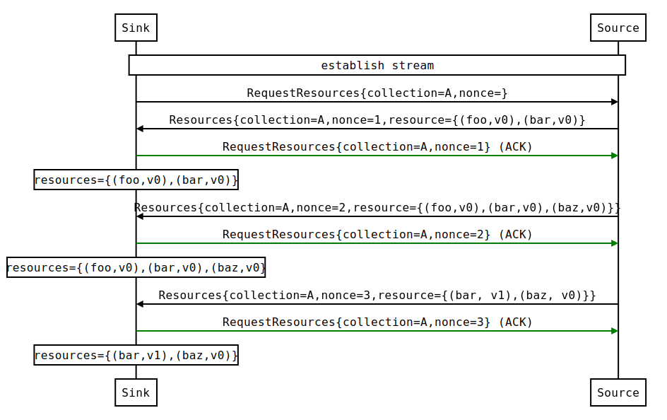
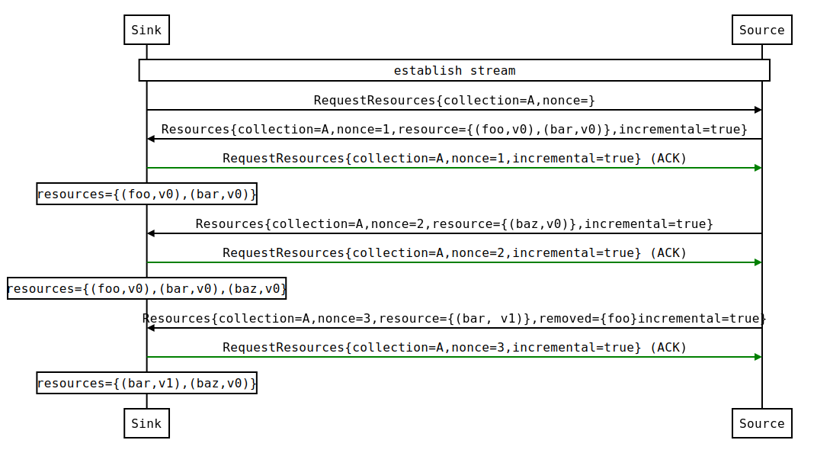
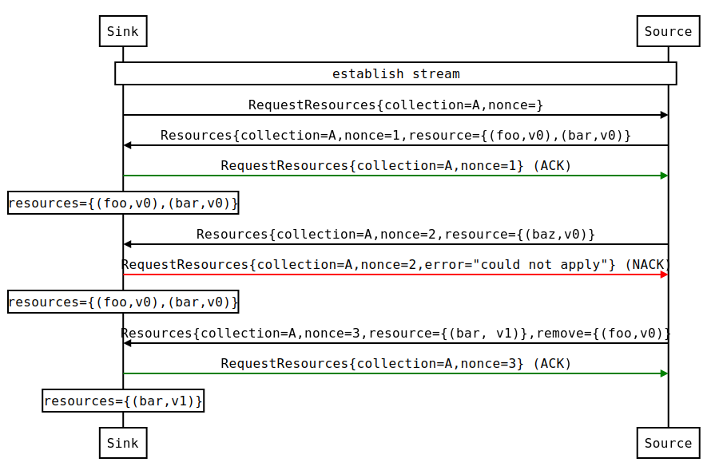

# Mesh Configuration Protocol (MCP)

## Introduction

This folder contains the proto buffers for the Mesh Configuration
Protocol (MCP). MCP is based on
[XDS](https://github.com/envoyproxy/data-plane-api/blob/master/XDS_PROTOCOL.md#streaming-grpc-subscriptions)
and maintains conceptual alignment with it, despite the specific
service and proto definitions being different.

## Overview

MCP is a subscription-based configuration distribution API. The
configuration consumer (i.e. sink) requests updates for collections of
resources from a configuration producer (i.e. source). The source
pushes resource updates to the sink when resources are added, updated,
or deleted. The sink positively ACK's the resource update, if it was
accepted, and NACK's if it was rejected, e.g. because a resource was
invalid. The source may push additional update once the previous
update was ACK/NACK'd. The source should only have one outstanding
update (per-collection) in flight at a time.

MCP is a pair of bidirectional streaming gRPC API services
(`ResourceSource` and `ResourceSink`).

* The `ResourceSource` service is used when the resource source is the
server and the sink is a client. By default, Galley implements the
`ResourceSource` service and Pilot/Mixer connect as clients.

* The `ResourceSink` service is used when the resource source is a
client and the sink is the server. Galley can be configured to
optionally "dial-out" to a remote configuration sink, e.g. Pilot is in
another cluster where it cannot, as a client, initiate
connection to Galley. In this scenario, Pilot would implement the
`ResourceSink` service and Galley would connect as a client.

ResourceSource and ResourceSink are semantically equivalent with
regards to the message exchange. The only meaningful difference is who
initiates the connection and opens the grpc stream.

## Data model

MCP is the mechanism of transport whereby Pilot and Mixer can be
configured by a manager component. MCP defines a common per-resource
metadata format and resource specific contents is defined elsewhere
(e.g. https://github.com/istio/api/tree/master/networking/v1alpha3).

### Collections

Resources of the same type are organization into named
collections. Istio API collection names are of the form
`istio/<area>/<version>/<api>` where `<area>`, `<version>`, and `<api`
are defined by the [API style guidelines](../GUIDELINES.md). For
example, the collection name for VirtualService is
`istio/networking/v1alpha3/virtualservices`.

### Metadata

## Connection establishment

* `ResourceSource` service - The client is the resource sink. The
client dials the server and establishes a new gRPC stream. The client
sends RequestResources and receive Resources messages.

* `ResourceSink` service - The client is the resource source. The
client dials the server and establishes a new gRPC stream. The server
sends RequestResources and receive Resources messages.

## Configuration updates

The following overview applies to both ResourceSink and ResourceSource
services, regardless of client/server roles.

The resource update protocol is derived from Incremental xDS. The
protocol exchange is mostly the same except that resource hints have
been removed. Most of the text and diagrams below are copied from the
Incremental xDS docs and adjusted accordingly.

In MCP, resources are first organized by collection. Within each
collection, resources are uniquely identifiable by their metadata
name. Individual resources are versioned to differentiate newer
versions of the same named resource.

A `RequestResource` message can be sent in two situations:

* Initial message in an MCP bidirectional change stream

* As an ACK or NACK response to a previous `Resources` message. In
this case the `response_nonce` is set to the nonce value from the
`Resources` message. ACK/NACK is determined by the presence of
`error_detail` in the subsequent request.

The initial `RequestResources` messages includes the collection
corresponding to the subscribed set of resources
(e.g. VirtualService), the node sink identifier, and nonce fields, and
initial_resource_version (more on that later). The source send a
`Resources` message when the requested resources are available.  After
processing the `Resources` message , the sink sends a new
`RequestResources` message on the stream, specifying the last version
successfully applied and the nonce provided by the source.

The nonce field is used to pair `RequestResources` and `Resources`
messages per collection. The source should only send one outstanding
`Resource` message at a time (per-collection) and wait for the sink to
ACK/NACK. Upon receiving an update, the sink is expected to send an
ACK/NACK relatively quickly after decoding, validating, and persisting
the update to its internal configuration store.

The source should ignore requests with stale and unknown nonces that
do not match the nonce in the most recently sent `Resource` message.

### Success examples

The following example shows the sink receiving a sequence of changes
which are successfully ACK'd.

The following example shows the same desired resource delivered with
incremental updates. This example assumes incremental is supported by
the source. When source does not support incremental updates, the
pushed `Resources` will always have incremental set to false,
regardles of whether the sink requested an incremental update. At any
time, the source can decide to push a full-state update, ignoring the
sink's request. Both sides must negotiate (i.e. agree) to use
incremental on a per request/response basis for an update to be sent
incrementally.

### Error example

The following example shows what happens when a change cannot be applied.

The sink should only NACK in _exceptional_ cases. For example, if a set of 
resources was invalid, malformed, or could not be decoded. NACK'd updates
should raise an alarm for subsequent investigation by a human. The source 
should not resend the same set of resources that were previously NACK'd. 
Canary pushes to dedicated sinks may also be used to verify correctness 
(non-NACK) before pushing to a larger fleet of resource sinks.

The nonce in MCP is used to match RequestResources and Resources. On
reconnect, the sinks may attempt to resume a session with the same
source by specifying the known resources version with
initial_resource_version for each collection.
